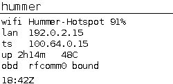
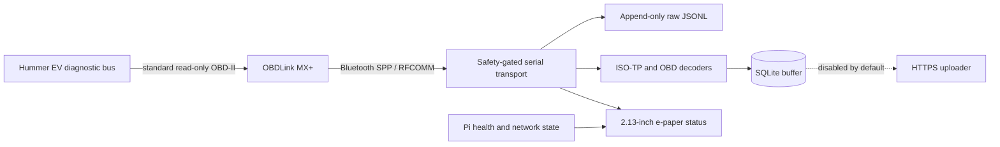

# Hummer EV read-only telemetry node

[](https://github.com/JeremyWhittaker/hummer_obdII/actions/workflows/tests.yml)
[](https://www.python.org/)
[](docs/SAFETY.md)

A safety-first Raspberry Pi telemetry appliance for a GMC Hummer EV. A
Raspberry Pi Zero 2 W talks to an OBDLink MX+ over Bluetooth RFCOMM, preserves
byte-exact diagnostic responses, decodes a deliberately small set of standard
OBD-II data, stores it locally in SQLite, and reports node health on a 2.13-inch
e-paper display.

This is an independent portfolio project. It is not affiliated with or
endorsed by General Motors, GMC, OBD Solutions, or Waveshare.

> [!CAUTION]
> Vehicle diagnostics can affect safety-critical systems. This project is
> intentionally read-only: every serial write passes through an allowlist, DTC
> clearing and control/write services are rejected, and unknown GM/Ultium
> identifiers are not guessed. Read [the safety model](docs/SAFETY.md) before
> connecting it to any vehicle.

> [!TIP]
> **Looking for what this can and cannot read? Start with
> [the access matrix](docs/ACCESS_MATRIX.md).** It is the one page organised by
> what is true now rather than by how it was found: every signal with its
> module, identifier, CAN priority and evidence level; every command class
> against all five safety gates; and 27 things that are out of reach, each with
> the *kind* of "no" it is and what would change it. Most of it is generated
> from the code that enforces it, and every claim carries a command that checks
> it — `PYTHONPATH=src python3 -m hummer_obd.access --check` fails if the page
> has drifted.



## What this project demonstrates

- A fail-closed command boundary: unknown commands never reach the adapter.
- Byte-exact, append-only JSONL transcripts using both hexadecimal and base64
  representations before parsing.
- Correct per-ECU ISO-TP reassembly for 29-bit CAN responses, including a
  fail-closed path for incomplete multi-frame messages.
- Bluetooth Secure Simple Pairing, SDP-based Serial Port Profile discovery,
  and persistent RFCOMM binding.
- Reconnect-aware polling, WAL-mode SQLite buffering, masked vehicle identity,
  and an uploader that is disabled by default.
- A hardware-free PTY/ELM simulator and 509 tests (391 subtests) covering the
  safety boundary, transport, decoding, storage, recovery, display, and
  end-to-end probe flow.
- Conservative e-paper operation: full refreshes only, unchanged frames are
  skipped, and the panel sleeps between updates.
- Headless deployment and systemd operation on a 512 MB-class Raspberry Pi.

## Capabilities

What this node can do, and what it deliberately cannot. Full detail, including
the evidence behind every claim, is in [Capabilities](docs/CAPABILITIES.md).

### Proven on the reference vehicle

| Capability | Result |
|---|---|
| Adapter identity | OBDLink MX+ r3.1.3, STN2255 v5.12.4, ELM327 v1.4b compatibility |
| Protocol | ISO 15765-4, CAN 29-bit, 500 kbit/s, auto-detected and re-confirmable |
| Standard PID discovery | all 14 Service 01 PIDs this vehicle advertises, read and decoded |
| Odometer | Service 01 PID `A6`, four bytes at 0.1 km per bit |
| Vehicle speed, run time, 12 V control-module voltage | live, from up to 8 responding ECUs. This is the low-voltage supply each module sees, **not** HV pack voltage |
| Distance since codes cleared, distance with MIL on, warm-up count | live |
| Diagnostic trouble codes | stored, pending and permanent, per responding module |
| Per-module attribution | every ECU's own answer to a PID, not just the first (eight voltages, 0.41 V spread) |
| On-board monitoring (service 06) | **proven**: answers, and advertises **zero** monitor IDs on this vehicle |
| Freeze frame (service 02) | **proven**: `020000` advertises `02 0D 1F 20`. No frame has been read, because the vehicle has no stored DTC to produce one |
| Vehicle information | VIN (masked outside the raw log), calibration IDs, calibration verification numbers, full module names |
| Module inventory | 8 modules named by the vehicle, including three drive-motor controllers |
| 12 V system voltage | `ATRV`, with **zero CAN traffic** — sampled on a timer while the vehicle sleeps |
| Live driving telemetry | speed to 94 km/h, odometer, and 12 V control-module voltage under load, from a bounded trial |
| Vehicle-state detection | awake, gateway-refusing, and fully asleep are distinguishable |
| Local persistence | byte-exact append-only transcript plus WAL-mode SQLite |
| Bounded collection | self-stopping trials by cycle count or wall-clock duration, under systemd supervision |
| Offline reporting | sanitized capability report that never opens the serial device |
| Node health | e-paper status page, Bluetooth recovery, reboot-safe services |
| Battery monitoring | PiSugar2 cell read over I2C, with the power IC identified by measurement rather than by label |
| **HV battery state of charge, energy remaining, range, distance since charge, temperature, charger power** | **proven**: six supervised enhanced reads (UDS service `22`) all answer from the Battery System Manager. They cross-check each other — range ÷ state of charge gives 333 mi at full against a 329 mi EPA rating, and the charger reads exactly 0 kW while the pack is measurably discharging. Dashboard cross-check still outstanding — see [GM enhanced candidates](docs/GM_ENHANCED_CANDIDATES.md) |
| **HV cell voltage, average / minimum / maximum** | **proven**: `0x2AF5` returns 4.0185 / 4.0171 / 4.0220 V — a **4.9 mV** cell spread. The published `min < avg < max` ordering holds exactly, which a wrong byte offset would almost always break, and 4.02 V is where a cell sits at the 80.85 % this truck independently reported |
| **Body control module** | nine identifiers at module `40`: an EVSE current, three battery group voltages, three battery temperatures and two coolant temperatures. Reachable **only at CAN priority `0x18`** -- it returned nothing at all at `0x14`, which made it look unreachable until a per-module support census showed it answering the legislated services. Every value is kept raw: none of the scalings is established |
| **Traction pack voltage, current and HV power** | **proven**: `0x2885` and `0x2414` from `DMCM-DriveMotorCtrl`. Measured while charging: 388.60 V, −20.95 A, −8.14 kW. Volts × amps agrees within 6 % with the charge power derived independently from the energy field's slope |
| **Drive-motor module voltage** | `0x33E5` from all three drive motor controllers, 13.2 / 13.1 / 13.1 V — the 12 V domain, not the pack |
| **Chassis dynamics** | wheel speed at all four corners, brake pressure, steering angle, and lateral/longitudinal acceleration, from `BSCM-BrakeSystem`. Scalings were derived from captured test vectors and reproduce every one exactly |
| **Automatic session recording** | `hummer-drive.service` records a decoded CSV whenever the vehicle is awake -- the column list is `drive.COLUMNS`, which is the one place to read it, and is deliberately not restated here because a count written down has gone stale twice and sends **only `ATRV`** while it sleeps. Rows are flushed and `fsync`ed as they are taken, so a session survives the vehicle cutting power |
| **Charge / discharge power** | derived from the energy field's slope, because the published "charger DC power" identifier is non-zero at idle on this vehicle and does not scale to a measured rate. Validated against a real AC charge: 7.81 kW computed offline, 7.84 kW live |

### Deliberately not available

| Not available | Why |
|---|---|
| DTC clearing, actuator tests, any UDS write/control/security service | Permanently forbidden by the safety gate. Not a configuration option |
| Mode 22 in unattended collection | Service `22` is still refused by the gate the collector uses. Enhanced reads exist only behind a separate, narrower gate that accepts an exact enumerated identifier and must be run deliberately — see [GM enhanced candidates](docs/GM_ENHANCED_CANDIDATES.md) |
| Identifier sweeping / guessing | An identifier is added only when a fetchable source names it exactly. The gate refuses `0x27C5` and `0x27C7` — one step either side of the one that works |
| Per-cell temperature, individually | The pack reports a temperature, and module `CB` answers a 24-value array whose scaling is not established. Nothing read here resolves an individual cell's temperature. (Pack **voltage** was listed here until 2026-09-03 and is now proven — see the row above. The claim outlived the fact by a day) |
| Remote commands (lock, unlock, precondition, start) | Out of scope. This node has no vehicle write authority of any kind |
| GPS / location | No receiver, and location is not an OBD-II service |
| OnStar / GM cloud data | A different system. Belongs in a separate broker with isolated credentials |
| Raw transcript upload | Refused at config load: raw logs can contain an unmasked VIN |
| Continuous collector autostart | Gated on two unproven physical results: overnight 12 V stability, and sleep while actively polling |
| Automatic power-off on low battery | Deliberately not the default. A PiSugar2 cannot power the Pi back on, so halting would strand the node; the watch stops vehicle polling instead |

Report the live state of a node at any time, without touching the vehicle:

```bash
hummer-obd-capabilities --root .
```

Read back what a recorded drive or charge actually shows -- also offline, and
also without opening the port:

```bash
hummer-obd-analyze --dir evidence/sessions --expected-period-s 5.5
```

The report leads with capture quality, because a recorder that is running looks
exactly like a recorder that is running *well*: it measures the sample period
the session really achieved, and counts the gaps where samples should have been
and were not. Only then does it report distance, energy, efficiency, pack
voltage and current, regenerated energy, cell spread, and chassis extremes.

It also normalizes the two power columns against each other. `hv_power_kw` is
`pack_v x pack_a` and is **positive while discharging**; `power_kw` is the slope
of `energy_kwh`, which is energy *remaining*, so it is **negative while
discharging**. Keeping both and reporting their disagreement is deliberate --
two independent routes to one quantity is what caught a mislabelled identifier
earlier in this project.

See every sensor the node can collect, and which ones are actually answering:

```bash
hummer-obd-live --watch
```

One line per column: the value, the identifier that carries it, and how long
since it last answered, grouped by the module it comes from. Columns holding
several values in one cell are broken out individually -- `0x2B43`'s 26
per-module readings are shown one per line with each one's drift from its
neighbours, which is the earliest visible sign of a single module going bad.
`--compact` leaves them collapsed. What the pack's own data says about its
structure is in [Pack architecture](docs/PACK_ARCHITECTURE.md). A sensor that has
gone quiet reads completely differently from one reporting zero, which is the
distinction that matters when something is wrong and the one a CSV cannot show
you. This also never opens the serial device -- it reads the session the
recorder is already writing, so it is safe to run while driving and adds no
traffic to the vehicle.

### Every command

Fourteen are installed; the list is `[project.scripts]` in `pyproject.toml`.
The right-hand column is the one that matters operationally.

| Command | What it does | Touches the vehicle? |
|---|---|---|
| `hummer-obd-capabilities` | Sanitized report of a node's live state | **no** |
| `hummer-obd-analyze` | Reads a session back; `--trend` compares them all | **no** |
| `hummer-obd-live` | Every sensor and how long since it answered | **no** |
| `hummer-obd-decode` | Correlates undecoded raw fields against measured quantities | **no** |
| `hummer-obd-export` | Local export of stored telemetry | **no** |
| `hummer-obd-drive` | The automatic session recorder (a service) | yes — `ATRV` only while asleep |
| `hummer-obd-collector` | Reconnect-aware poller, disabled by default | yes — standard OBD only |
| `hummer-obd-probe` | Supervised one-shot probe, and offline replay | yes |
| `hummer-obd-discover` | Per-module support census, J1979 bitmaps only | yes — no vendor identifier |
| `hummer-obd-enhanced` | Supervised enhanced reads, one exact profile | yes — enumerated identifiers |
| `hummer-obd-voltage` | 12 V watch that provably transmits nothing | yes — `ATRV` only |
| `hummer-obd-passive` | Listens at the connector; the adapter does not even acknowledge | yes — adapter setup only, no request |
| `hummer-obd-display` | Renders the e-paper status page | no |
| `hummer-obd-recover` | Re-binds an already bonded adapter | no |

Only one process may own `/dev/rfcomm0` at a time. Everything in the "no"
column reads files the recorder already wrote, so it is safe alongside it —
including while driving. Everything else needs `hummer-drive` stopped first,
and the sessions pulled to a workstation before that. See the
[runbook](docs/RUNBOOK.md#drive-recorder).

## System overview



The raw transcript and parsed database are separate by design. Parsing can be
fixed and replayed later without losing what the adapter actually returned.
See [Architecture](docs/ARCHITECTURE.md) for the component and trust-boundary
details.

## Safety boundary

| Allowed | Rejected |
|---|---|
| OBDLink `AT`/`ST` identification and setup | Mode `04` DTC clearing |
| Mode `01` current data | Mode `08` actuator/control tests |
| Mode `02` freeze frame data | UDS write, control, security, reset, and routine services |
| Modes `03`, `07`, `0A` DTC reads | Mode `22` enhanced PID discovery in this release |
| Mode `06` on-board monitoring test results | |
| Mode `09` vehicle information | |

Every allowed service is a request for data the ECU already holds. Modes `02`
and `06` were added on 2026-09-01 under the change-control process in
[Safety](docs/SAFETY.md); unlike Mode `22` they are standard SAE J1979 reads
and need no vendor identifier to be guessed.

The denylist is defense in depth; the primary control is an allowlist in
[`src/hummer_obd/safety.py`](src/hummer_obd/safety.py). The transport validates
each command immediately before writing it. There is no runtime bypass flag.

## Hardware and validated platform

| Component | Validated hardware |
|---|---|
| Computer | Raspberry Pi Zero 2 W |
| Vehicle adapter | OBDLink MX+ |
| Display | Waveshare 2.13-inch E-Ink Display HAT V4, 250x122, black/white |
| Interface | Bluetooth Classic SPP exposed as `/dev/rfcomm0`; display over SPI |
| Operating system | Raspberry Pi OS / Debian 13 (`trixie`), 64-bit |
| Python | 3.11 or newer |

The official Waveshare `epd2in13_V4` driver is fetched by a pinned,
provenance-recording installer rather than copied into Git.

## Repository layout

```text
src/hummer_obd/
  safety.py          command allowlist and independent forbidden-service checks
  rawlog.py          fsync'd append-only byte transcript
  transport.py       guarded RFCOMM serial transport and reconnect backoff
  session.py         adapter initialization and read-only query orchestration
  decode.py          OBD-II decoding and per-ECU 29-bit CAN ISO-TP reassembly
  storage.py         WAL-mode SQLite schema and local queue markers
  collector.py       reconnect-aware poller; disabled by default, bounded trials
  capabilities.py    sanitized offline capability report; never opens the port
  export.py          local export of stored telemetry for external ingestion
  voltage.py         12 V watch that provably transmits nothing to the vehicle
  battery.py         PiSugar2 cell watch and low-battery response
  policy.py          adaptive awake/parked/asleep collection policy
  enhanced.py        supervised enhanced (UDS service 22) reads, one identifier
                     at a time, from a fixed enumeration
  drive.py           automatic drive/charge session recorder; ATRV only while
                     the vehicle sleeps
  analyze.py         offline analysis of a recorded session; never opens the port
  live.py            text view of every sensor and whether it is still
                     answering; never opens the port either
  registry.py        renders the identifier registry into the docs from the
                     safety gate itself, so the two cannot drift
  decode_fields.py   correlates undecoded raw columns against measured
                     quantities, so a published figure can be rechecked
  discover.py        per-module support census using only J1979's own bitmaps;
                     sends no vendor identifier and guesses nothing
  probe.py           supervised one-shot probe and offline replay
  btdiscover.py      recovery/binding for an already bonded adapter
  display/status.py  hardware-free renderer and Waveshare panel writer
config/              safe example configuration
scripts/             deployment, pairing, SD-card, Wi-Fi, trial, and smoke tooling
systemd/             display, RFCOMM, recovery, collector, trial, battery and
                     drive-recorder units
tests/               unit and PTY-backed integration tests
docs/                architecture, build, operations, safety, and handoff notes
```

## Development quick start

No vehicle or Raspberry Pi is needed to run the test suite.

```bash
git clone git@github.com:JeremyWhittaker/hummer_obdII.git
cd hummer_obdII

python3 -m venv .venv
source .venv/bin/activate
python -m pip install --upgrade pip
python -m pip install -e '.[dev]'

python -m pytest -q
python -m unittest discover -s tests -t tests -q
```

Render a hardware-free status frame:

```bash
hummer-obd-display --once --simulate /tmp/hummer-status.png
```

Report what the node can do, reading only local evidence and never opening the
serial device:

```bash
hummer-obd-capabilities --root .
```

Replay an existing private transcript without touching a vehicle:

```bash
python scripts/review_raw_log.py /path/to/probe-session.jsonl
```

Raw logs can contain a VIN and are intentionally excluded from Git.

## Build and deploy

The complete reproducible procedure is in [Build and deploy](docs/BUILD_AND_DEPLOY.md).
The short version is:

1. Prepare a headless Pi with SSH, NetworkManager, Bluetooth, SPI, and the
   required Python/system packages.
2. Deploy the repository with `HOST=user@pi-host scripts/deploy.sh`.
3. Run `scripts/bootstrap_pi.sh` on the Pi; it installs but does not enable the
   systemd units.
4. Render the e-paper display once before enabling its service.
5. Pair the OBDLink interactively, confirm its SPP channel with SDP, and bind
   `/dev/rfcomm0`.
6. Run one read-only probe, review its raw transcript offline, and only then run
   a one-shot collector cycle.

The continuous collector is intentionally still off on the validated vehicle.
Sleep with the Pi and adapter attached *and polling stopped* has been observed
with a zero-CAN-traffic voltage watch. Two things remain unproven: overnight
12 V stability with the hardware attached, and whether the vehicle still sleeps
while a diagnostic loop is actively polling. Autostart stays gated on both.

## Validated result

The reference deployment has demonstrated:

- successful OBDLink MX+ pairing, bonding, trust, SDP discovery, and RFCOMM
  channel binding;
- adapter identity `ELM327 v1.4b`, `STN2255 v5.12.4`, and
  `OBDLink MX+ r3.1.3`;
- automatic selection of ISO 15765-4, CAN 29-bit identifiers at 500 kbit/s;
- standard PID support discovery, vehicle speed/runtime, and control-module
  voltage reads;
- valid empty stored, pending, and permanent DTC results from all responding
  modules;
- a 17-character VIN decoded and masked outside the private raw transcript;
- no forbidden command, no Mode 22 request, and no DTC-clear request;
- one complete collector cycle with byte-exact raw logging and SQLite storage;
- a live e-paper status page and persistent reboot-safe display/RFCOMM units.

See [Validation](docs/VALIDATION.md) for the test matrix and evidence policy.

## Documentation

- [Architecture](docs/ARCHITECTURE.md) — components, data flow, trust boundaries,
  persistence, and service model.
- [Build and deploy](docs/BUILD_AND_DEPLOY.md) — from a clean Pi image to the
  reviewed one-shot collector.
- [Runbook](docs/RUNBOOK.md) — normal operation, service controls, recovery, and
  troubleshooting.
- [Safety](docs/SAFETY.md) — exact allowed/forbidden command classes and private
  data handling.
- [Validation](docs/VALIDATION.md) — automated and hardware-backed acceptance
  results.
- [CAN priority](docs/CAN_PRIORITY.md) — the priority each module answers
  service 22 at, measured at both. There is no universal one: module `28`
  answers only at `0x14` and module `40` only at `0x18`, which is why an
  address group carries its own.
- [Pack architecture](docs/PACK_ARCHITECTURE.md) — what the vehicle's own data
  says about its battery: 96 cells in series measured from two independent
  identifiers, and `0x2B43` resolved into 26 per-module values.
- [Probe, 2026-09-03](docs/PROBE_2026-09-03.md) — fifteen sourced candidates
  tested: five answered at the battery manager including a twenty-four-value
  array, and all nine at the body control module returned `NO DATA`.
- [Passive CAN validation](docs/PASSIVE_CAN_VALIDATION.md) — why passive
  monitoring at this vehicle's connector is very likely a dead end, and the
  bounded experiment that would confirm it.
- [Capabilities](docs/CAPABILITIES.md) — what the node, the adapter, and this
  vehicle can actually do, split into proven, available-but-unproven, and
  out of scope.
- **[Telemetry catalog](docs/TELEMETRY_CATALOG.md) — the single authoritative
  list of every signal this node can read, with its identifier, scaling, unit
  and evidence level. Start here.**
- [Module map](docs/GM_MODULE_MAP.md) — the eight modules this vehicle named
  for itself, what each has answered, and where sourced identifiers go next.
- [Enhanced PID validation](docs/ENHANCED_PID_VALIDATION.md) — the evidence bar
  Mode 22 identifiers must clear before any of them is allowed on the wire.
- [Future maintainer handoff](docs/HANDOFF.md) — invariants, current state, and
  the safe next milestone for humans or coding agents.

## Privacy and data ownership

The public repository contains no passwords, Wi-Fi keys, Tailscale keys,
private network addresses, adapter MAC address, VIN, raw vehicle transcript, or
telemetry database. Local runtime paths are denied by `.gitignore`; the raw log
reviewer masks vehicle identity before producing a summary.

This repository does not currently grant an open-source license. Source is
published for portfolio and review purposes; contact the owner before reuse or
redistribution.
