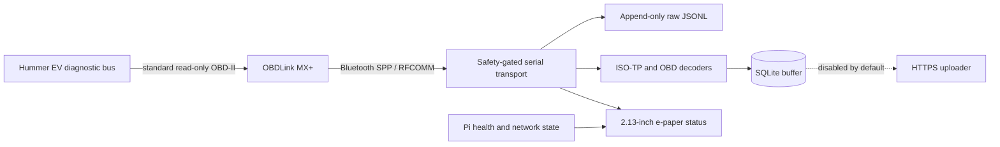

# Hummer EV read-only telemetry node

[](https://github.com/JeremyWhittaker/hummer_obdII/actions/workflows/tests.yml)
[](https://www.python.org/)
[](docs/SAFETY.md)

A safety-first Raspberry Pi telemetry appliance for a GMC Hummer EV. A
Raspberry Pi Zero 2 W talks to an OBDLink MX+ over Bluetooth RFCOMM, preserves
byte-exact diagnostic responses, decodes a deliberately small set of standard
OBD-II data, stores it locally in SQLite, and reports node health on a 2.13-inch
e-paper display.

This is an independent portfolio project. It is not affiliated with or
endorsed by General Motors, GMC, OBD Solutions, or Waveshare.

> [!CAUTION]
> Vehicle diagnostics can affect safety-critical systems. This project is
> intentionally read-only: every serial write passes through an allowlist, DTC
> clearing and control/write services are rejected, and unknown GM/Ultium
> identifiers are not guessed. Read [the safety model](docs/SAFETY.md) before
> connecting it to any vehicle.


## What this project demonstrates

- A fail-closed command boundary: unknown commands never reach the adapter.
- Byte-exact, append-only JSONL transcripts using both hexadecimal and base64
  representations before parsing.
- Correct per-ECU ISO-TP reassembly for 29-bit CAN responses, including a
  fail-closed path for incomplete multi-frame messages.
- Bluetooth Secure Simple Pairing, SDP-based Serial Port Profile discovery,
  and persistent RFCOMM binding.
- Reconnect-aware polling, WAL-mode SQLite buffering, masked vehicle identity,
  and an uploader that is disabled by default.
- A hardware-free PTY/ELM simulator and 134 tests (151 subtests) covering the
  safety boundary, transport, decoding, storage, recovery, display, and
  end-to-end probe flow.
- Conservative e-paper operation: full refreshes only, unchanged frames are
  skipped, and the panel sleeps between updates.
- Headless deployment and systemd operation on a 512 MB-class Raspberry Pi.

## System overview



The raw transcript and parsed database are separate by design. Parsing can be
fixed and replayed later without losing what the adapter actually returned.
See [Architecture](docs/ARCHITECTURE.md) for the component and trust-boundary
details.

## Safety boundary

| Allowed | Rejected |
|---|---|
| OBDLink `AT`/`ST` identification and setup | Mode `04` DTC clearing |
| Mode `01` current data | Mode `08` actuator/control tests |
| Modes `03`, `07`, `0A` DTC reads | UDS write, control, security, reset, and routine services |
| Mode `09` vehicle information | Mode `22` enhanced PID discovery in this release |

The denylist is defense in depth; the primary control is an allowlist in
[`src/hummer_obd/safety.py`](src/hummer_obd/safety.py). The transport validates
each command immediately before writing it. There is no runtime bypass flag.

## Hardware and validated platform

| Component | Validated hardware |
|---|---|
| Computer | Raspberry Pi Zero 2 W |
| Vehicle adapter | OBDLink MX+ |
| Display | Waveshare 2.13-inch E-Ink Display HAT V4, 250x122, black/white |
| Interface | Bluetooth Classic SPP exposed as `/dev/rfcomm0`; display over SPI |
| Operating system | Raspberry Pi OS / Debian 13 (`trixie`), 64-bit |
| Python | 3.11 or newer |

The official Waveshare `epd2in13_V4` driver is fetched by a pinned,
provenance-recording installer rather than copied into Git.

## Repository layout

```text
src/hummer_obd/
  safety.py          command allowlist and independent forbidden-service checks
  rawlog.py          fsync'd append-only byte transcript
  transport.py       guarded RFCOMM serial transport and reconnect backoff
  session.py         adapter initialization and read-only query orchestration
  decode.py          OBD-II decoding and per-ECU 29-bit CAN ISO-TP reassembly
  storage.py         WAL-mode SQLite schema and local queue markers
  collector.py       reconnect-aware poller; disabled by default
  probe.py           supervised one-shot probe and offline replay
  btdiscover.py      recovery/binding for an already bonded adapter
  display/status.py  hardware-free renderer and Waveshare panel writer
config/              safe example configuration
scripts/             deployment, pairing, SD-card, Wi-Fi, and smoke tooling
systemd/             display, RFCOMM, recovery, and collector units
tests/               unit and PTY-backed integration tests
docs/                architecture, build, operations, safety, and handoff notes
```

## Development quick start

No vehicle or Raspberry Pi is needed to run the test suite.

```bash
git clone git@github.com:JeremyWhittaker/hummer_obdII.git
cd hummer_obdII

python3 -m venv .venv
source .venv/bin/activate
python -m pip install --upgrade pip
python -m pip install -e '.[dev]'

python -m pytest -q
python -m unittest discover -s tests -t tests -q
```

Render a hardware-free status frame:

```bash
hummer-obd-display --once --simulate /tmp/hummer-status.png
```

Replay an existing private transcript without touching a vehicle:

```bash
python scripts/review_raw_log.py /path/to/probe-session.jsonl
```

Raw logs can contain a VIN and are intentionally excluded from Git.

## Build and deploy

The complete reproducible procedure is in [Build and deploy](docs/BUILD_AND_DEPLOY.md).
The short version is:

1. Prepare a headless Pi with SSH, NetworkManager, Bluetooth, SPI, and the
   required Python/system packages.
2. Deploy the repository with `HOST=user@pi-host scripts/deploy.sh`.
3. Run `scripts/bootstrap_pi.sh` on the Pi; it installs but does not enable the
   systemd units.
4. Render the e-paper display once before enabling its service.
5. Pair the OBDLink interactively, confirm its SPP channel with SDP, and bind
   `/dev/rfcomm0`.
6. Run one read-only probe, review its raw transcript offline, and only then run
   a one-shot collector cycle.

The continuous collector is intentionally still off on the validated vehicle.
A two-second diagnostic loop may prevent vehicle modules from sleeping, so
autostart remains gated on a full sleep/wake observation or confirmed
ignition-switched Pi power.

## Validated result

The reference deployment has demonstrated:

- successful OBDLink MX+ pairing, bonding, trust, SDP discovery, and RFCOMM
  channel binding;
- adapter identity `ELM327 v1.4b`, `STN2255 v5.12.4`, and
  `OBDLink MX+ r3.1.3`;
- automatic selection of ISO 15765-4, CAN 29-bit identifiers at 500 kbit/s;
- standard PID support discovery, vehicle speed/runtime, and control-module
  voltage reads;
- valid empty stored, pending, and permanent DTC results from all responding
  modules;
- a 17-character VIN decoded and masked outside the private raw transcript;
- no forbidden command, no Mode 22 request, and no DTC-clear request;
- one complete collector cycle with byte-exact raw logging and SQLite storage;
- a live e-paper status page and persistent reboot-safe display/RFCOMM units.

See [Validation](docs/VALIDATION.md) for the test matrix and evidence policy.

## Documentation

- [Architecture](docs/ARCHITECTURE.md) — components, data flow, trust boundaries,
  persistence, and service model.
- [Build and deploy](docs/BUILD_AND_DEPLOY.md) — from a clean Pi image to the
  reviewed one-shot collector.
- [Runbook](docs/RUNBOOK.md) — normal operation, service controls, recovery, and
  troubleshooting.
- [Safety](docs/SAFETY.md) — exact allowed/forbidden command classes and private
  data handling.
- [Validation](docs/VALIDATION.md) — automated and hardware-backed acceptance
  results.
- [Future maintainer handoff](docs/HANDOFF.md) — invariants, current state, and
  the safe next milestone for humans or coding agents.

## Privacy and data ownership

The public repository contains no passwords, Wi-Fi keys, Tailscale keys,
private network addresses, adapter MAC address, VIN, raw vehicle transcript, or
telemetry database. Local runtime paths are denied by `.gitignore`; the raw log
reviewer masks vehicle identity before producing a summary.

This repository does not currently grant an open-source license. Source is
published for portfolio and review purposes; contact the owner before reuse or
redistribution.
