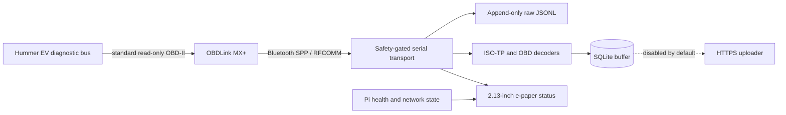

# Hummer EV read-only telemetry node

[](https://github.com/JeremyWhittaker/hummer_obdII/actions/workflows/tests.yml)
[](https://www.python.org/)
[](docs/SAFETY.md)

A safety-first Raspberry Pi telemetry appliance for a GMC Hummer EV. A
Raspberry Pi Zero 2 W talks to an OBDLink MX+ over Bluetooth RFCOMM, preserves
byte-exact diagnostic responses, decodes a deliberately small set of standard
OBD-II data, stores it locally in SQLite, and reports node health on a 2.13-inch
e-paper display.

This is an independent portfolio project. It is not affiliated with or
endorsed by General Motors, GMC, OBD Solutions, or Waveshare.

> [!CAUTION]
> Vehicle diagnostics can affect safety-critical systems. This project is
> intentionally read-only: every serial write passes through an allowlist, DTC
> clearing and control/write services are rejected, and unknown GM/Ultium
> identifiers are not guessed. Read [the safety model](docs/SAFETY.md) before
> connecting it to any vehicle.

> [!TIP]
> **Looking for what this can and cannot read? Start with
> [the access matrix](docs/ACCESS_MATRIX.md).** It is the one page organised by
> what is true now rather than by how it was found: every signal with its
> module, identifier, CAN priority and evidence level; every command class
> against all five safety gates; and 27 things that are out of reach, each with
> the *kind* of "no" it is and what would change it. Most of it is generated
> from the code that enforces it, and every claim carries a command that checks
> it — `PYTHONPATH=src python3 -m hummer_obd.access --check` fails if the page
> has drifted.


## What this project demonstrates

- A fail-closed command boundary: unknown commands never reach the adapter.
- Byte-exact, append-only JSONL transcripts using both hexadecimal and base64
  representations before parsing.
- Correct per-ECU ISO-TP reassembly for 29-bit CAN responses, including a
  fail-closed path for incomplete multi-frame messages.
- Bluetooth Secure Simple Pairing, SDP-based Serial Port Profile discovery,
  and persistent RFCOMM binding.
- Reconnect-aware polling, WAL-mode SQLite buffering, masked vehicle identity,
  and an uploader that is disabled by default.
- A hardware-free PTY/ELM simulator and a test suite covering the
  safety boundary, transport, decoding, storage, recovery, display, and
  end-to-end probe flow.
- Conservative e-paper operation: full refreshes only, unchanged frames are
  skipped, and the panel sleeps between updates.
- Headless deployment and systemd operation on a 512 MB-class Raspberry Pi.

## Capabilities

What this node can do, and what it deliberately cannot. Full detail, including
the evidence behind every claim, is in [Capabilities](docs/CAPABILITIES.md).

### Proven on the reference vehicle

| Capability | Result |
|---|---|
| Adapter identity | OBDLink MX+ r3.1.3, STN2255 v5.12.4, ELM327 v1.4b compatibility |
| Protocol | ISO 15765-4, CAN 29-bit, 500 kbit/s, auto-detected and re-confirmable |
| Standard PID discovery | all 14 Service 01 PIDs this vehicle advertises, read and decoded |
| Odometer | Service 01 PID `A6`, four bytes at 0.1 km per bit |
| Vehicle speed, run time, 12 V control-module voltage | live, from up to 8 responding ECUs. This is the low-voltage supply each module sees, **not** HV pack voltage |
| Distance since codes cleared, distance with MIL on, warm-up count | live |
| Diagnostic trouble codes | stored, pending and permanent, per responding module |
| Per-module attribution | every ECU's own answer to a PID, not just the first (eight voltages, 0.41 V spread) |
| On-board monitoring (service 06) | **proven**: answers, and advertises **zero** monitor IDs on this vehicle |
| Freeze frame (service 02) | **proven**: `020000` advertises `02 0D 1F 20`. No frame has been read, because the vehicle has no stored DTC to produce one |
| Vehicle information | VIN (masked outside the raw log), calibration IDs, calibration verification numbers, full module names |
| Module inventory | 8 modules named by the vehicle, including three drive-motor controllers |
| 12 V system voltage | `ATRV`, with **zero CAN traffic** — sampled on a timer while the vehicle sleeps |
| Live driving telemetry | speed to 143 km/h, odometer, and 12 V control-module voltage under load. No longer a bounded trial: whole drives record unattended, and the standard PID `010D` and the enhanced wheel speeds agree at 143.0 km/h exactly |
| Vehicle-state detection | awake, gateway-refusing, and fully asleep are distinguishable |
| Local persistence | byte-exact append-only transcript plus WAL-mode SQLite |
| Bounded collection | self-stopping trials by cycle count or wall-clock duration, under systemd supervision |
| Offline reporting | sanitized capability report that never opens the serial device |
| Node health | e-paper status page, Bluetooth recovery, reboot-safe services |
| Battery monitoring | PiSugar2 cell read over I2C, with the power IC identified by measurement rather than by label |
| **HV battery state of charge, energy remaining, range, distance since charge, temperature, charger power** | **proven**: six supervised enhanced reads (UDS service `22`) all answer from the Battery System Manager. They cross-check each other — range ÷ state of charge gives 333 mi at full against a 329 mi EPA rating, and the charger reads exactly 0 kW while the pack is measurably discharging. Dashboard cross-check still outstanding — see [GM enhanced candidates](docs/GM_ENHANCED_CANDIDATES.md) |
| **HV cell voltage, average / minimum / maximum** | **proven**: `0x2AF5` returns 4.0185 / 4.0171 / 4.0220 V — a **4.9 mV** cell spread. The published `min < avg < max` ordering holds exactly, which a wrong byte offset would almost always break, and 4.02 V is where a cell sits at the 80.85 % this truck independently reported |
| **Body control module** | nine identifiers at module `40`: an EVSE current, three battery group voltages, three battery temperatures and two coolant temperatures. Reachable **only at CAN priority `0x18`** -- it returned nothing at all at `0x14`, which made it look unreachable until a per-module support census showed it answering the legislated services. Every value is kept raw: none of the scalings is established |
| **Traction pack voltage, current and HV power** | **proven**: `0x2885` and `0x2414` from `DMCM-DriveMotorCtrl`. Measured while charging: 388.60 V, −20.95 A, −8.14 kW. Volts × amps agrees within 6 % with the charge power derived independently from the energy field's slope |
| **Pack internal resistance** | **measured**: **18.59 ± 0.11 mΩ** (0.194 mΩ/cell at 96S) from 550 consecutive-step ΔV/ΔI pairs, r = −0.991, over a 905 A current swing. Decomposes into ~19.9 mΩ instantaneous plus ~2.1 mΩ depending on the previous sample, so ~18.6 mΩ on a 7 s step and ~22.1 mΩ sustained |
| **The same pack voltage, from a second module** | `0x2885` answers at modules 17, 1D and 1E. It was read at 17 only, which meant the project's headline measurement had no check on it at all: internal consistency cannot tell you that a decode is wrong, only that it is stable. 1D is now read too, at the cost of one extra request, because the recorder already addresses 1D every cycle. 1E is left uncaptured on purpose and the reason is written down in `drive.UNCAPTURED` — reaching it needs a whole address preamble for a third opinion, and two are enough to detect a disagreement. **Result, 2026-09-10:** over 57 paired samples the two agree to a mean of +0.032 V — 0.008% of a 386 V reading. What scatter remains identifies itself as sampling skew rather than a decode error: it doubles when current is slewing fast (0.644 V against 0.311 V) and peaks at a regen crossing, while the bias stays at essentially zero |
| **Drive/regen torque signal** | `0x2429`, a bipolar quantity zero-referenced at **22534** — constant across 1,083 stationary samples, reversing with torque direction on 25 of 27 zero crossings, tracking power ÷ speed at R² = 0.926. The source's "nominal pack voltage" label is falsified: pack voltage swung 377 V across 526 samples while this field did not move. **No scaling is claimed** — the fitted constant is not round |
| **Drive-motor module voltage** | `0x33E5` from all three drive motor controllers, 13.2 / 13.1 / 13.1 V — the 12 V domain, not the pack |
| **Chassis dynamics** | wheel speed at all four corners, brake pressure, steering angle, and lateral/longitudinal acceleration, from `BSCM-BrakeSystem`. Scalings were derived from captured test vectors and reproduce every one exactly |
| **Automatic session recording** | `hummer-drive.service` records a decoded CSV whenever the vehicle is awake -- the column list is `drive.COLUMNS`, which is the one place to read it, and is deliberately not restated here because a count written down has gone stale twice and sends **only `ATRV`** while it sleeps. Rows are flushed and `fsync`ed as they are taken, so a session survives the vehicle cutting power |
| **Charge / discharge power** | derived from the energy field's slope, because the published "charger DC power" identifier is non-zero at idle on this vehicle and does not scale to a measured rate. Validated against a real AC charge: 7.81 kW computed offline, 7.84 kW live |

### Deliberately not available

| Not available | Why |
|---|---|
| DTC clearing, actuator tests, any UDS write/control/security service | Permanently forbidden by the safety gate. Not a configuration option |
| Mode 22 in unattended collection | Service `22` is still refused by the gate the collector uses. Enhanced reads exist only behind a separate, narrower gate that accepts an exact enumerated identifier and must be run deliberately — see [GM enhanced candidates](docs/GM_ENHANCED_CANDIDATES.md) |
| Identifier sweeping / guessing | An identifier is added only when a fetchable source names it exactly. The gate refuses `0x27C5` and `0x27C7` — one step either side of the one that works |
| Per-cell temperature, individually | The pack reports a temperature, and module `CB` answers a 24-value array whose scaling is not established. Nothing read here resolves an individual cell's temperature. (Pack **voltage** was listed here until 2026-09-03 and is now proven — see the row above. The claim outlived the fact by a day) |
| Remote commands (lock, unlock, precondition, start) | Out of scope. This node has no vehicle write authority of any kind |
| GPS / location | No receiver, and location is not an OBD-II service |
| OnStar / GM cloud data | A different system. Belongs in a separate broker with isolated credentials |
| Raw transcript upload | Refused at config load: raw logs can contain an unmasked VIN |
| Continuous collector autostart | Gated on two unproven physical results: overnight 12 V stability, and sleep while actively polling |
| Automatic power-off on low battery | Deliberately not the default. A PiSugar2 cannot power the Pi back on, so halting would strand the node; the watch stops vehicle polling instead |

Report the live state of a node at any time, without touching the vehicle:

```bash
hummer-obd-capabilities --root .
```

Read back what a recorded drive or charge actually shows -- also offline, and
also without opening the port:

```bash
hummer-obd-analyze --dir evidence/sessions --expected-period-s 5.5
```

The report leads with capture quality, because a recorder that is running looks
exactly like a recorder that is running *well*: it measures the sample period
the session really achieved, and counts the gaps where samples should have been
and were not. Only then does it report distance, energy, efficiency, pack
voltage and current, regenerated energy, cell spread, and chassis extremes.

It also normalizes the two power columns against each other. `hv_power_kw` is
`pack_v x pack_a` and is **positive while discharging**; `power_kw` is the slope
of `energy_kwh`, which is energy *remaining*, so it is **negative while
discharging**. Keeping both and reporting their disagreement is deliberate --
two independent routes to one quantity is what caught a mislabelled identifier
earlier in this project.

See every sensor the node can collect, and which ones are actually answering:

```bash
hummer-obd-live --watch
```

It opens with a **derived block** -- what the raw numbers actually mean --
computed live from the session in progress: pack voltage, current and power,
cells in series, state of charge with the pack capacity it implies, **internal
resistance fitted from the session's own current steps**, distance, efficiency
over the moving window, regen fraction, the `0x2429` torque signal as signed
counts from its measured zero, the three 12 V readings, powertrain and charging
state, and the since-last-charge counters.

Two rules that block is built on. Pack state is read only from rows that pass
the sanity filter, because the last row of a session is usually the vehicle
dropping its contactors and a naive read shows a 1.06 V pack. And efficiency is
measured over the **moving** window only -- a session that sat with the air
conditioning on for forty minutes drained kWh against zero distance, and
charging that to the drive turns a real 42 kWh/100km into 63.

Below it, one line per column: the value, the identifier that carries it, and
how long since it last answered, grouped by the module it comes from. Columns
holding several values in one cell are broken out individually -- `0x2B43`'s 26
per-module readings are shown one per line with each one's drift from its
neighbours, which is the earliest visible sign of a single module going bad.
`--compact` leaves them collapsed. What the pack's own data says about its
structure is in [Pack architecture](docs/PACK_ARCHITECTURE.md). A sensor that has
gone quiet reads completely differently from one reporting zero, which is the
distinction that matters when something is wrong and the one a CSV cannot show
you. This also never opens the serial device -- it reads the session the
recorder is already writing, so it is safe to run while driving and adds no
traffic to the vehicle.

### Every command

The list is `[project.scripts]` in `pyproject.toml` — a count written here has gone stale before.
The right-hand column is the one that matters operationally.

| Command | What it does | Touches the vehicle? |
|---|---|---|
| `hummer-obd-capabilities` | Sanitized report of a node's live state | **no** |
| `hummer-obd-analyze` | Reads a session back; `--trend` compares them all | **no** |
| `hummer-obd-live` | Derived quantities, then every sensor and how long since it answered | **no** |
| `hummer-obd-dashboard` | Local browser dashboard, session history, charts and a driving / stationary energy budget | **no** |
| `hummer-obd-decode` | Correlates undecoded raw fields against measured quantities | **no** |
| `hummer-obd-export` | Local export of stored telemetry | **no** |
| `hummer-obd-drive` | The automatic session recorder (a service) | yes — `ATRV` only while asleep |
| `hummer-obd-collector` | Reconnect-aware poller, disabled by default | yes — standard OBD only |
| `hummer-obd-probe` | Supervised one-shot probe, and offline replay | yes |
| `hummer-obd-discover` | Per-module support census, J1979 bitmaps only | yes — no vendor identifier |
| `hummer-obd-enhanced` | Supervised enhanced reads, one exact profile | yes — enumerated identifiers |
| `hummer-obd-voltage` | 12 V watch that provably transmits nothing | yes — `ATRV` only |
| `hummer-obd-passive` | Listens at the connector; the adapter does not even acknowledge | yes — adapter setup only, no request |
| `hummer-obd-passive-diff` | Compares two passive captures offline; never replays anything | **no** |
| `hummer-obd-access` | Renders the access matrix from the code that enforces it | **no** |
| `hummer-obd-experiment` | Records what a person observed, and marks when something happened | **no** |
| `hummer-obd-respond` | Says which recorded field moved between two marked events | **no** |
| `hummer-obd-display` | Renders the e-paper status page | no |
| `hummer-obd-recover` | Re-binds an already bonded adapter | no |

Only one process may own `/dev/rfcomm0` at a time. Everything in the "no"
column reads files the recorder already wrote, so it is safe alongside it —
including while driving. Everything else needs `hummer-drive` stopped first,
and the sessions pulled to a workstation before that. See the
[runbook](docs/RUNBOOK.md#drive-recorder).

### Hosting the page on Home Assistant

The node is a Pi Zero 2 W. Rendering a page for a browser it cannot see is not
the best use of it, so the interface can be hosted elsewhere while the node
keeps doing the thing it is well placed to do — sit on the OBD port and record.

```bash
# On the node: serve data only, and name the origins allowed to read it.
python3 -m hummer_obd.dashboard --host <node-ip> --port 8765 --expose-location \
    --api-only --allow-origin http://homeassistant.local:8123

# On a machine with the repository: stamp the node's address into the page.
python3 -m hummer_obd.hapanel --api http://<node-ip>:8765 --out dist/index.html

# Home Assistant's SSH add-on disables sftp, so pipe it in.
ssh homeassistant 'sudo mkdir -p /config/www/hummer && sudo chown $USER /config/www/hummer'
ssh homeassistant 'cat > /config/www/hummer/index.html' < dist/index.html
```

It is then at `/local/hummer/index.html`, which an `iframe` card can point at.

**There is exactly one `dashboard.html` in this repository.** The panel is
generated from it rather than maintained beside it, because two copies of an
interface both render and only one of them is right, with nothing to say
which. `hummer-obd-hapanel` stamps in the node's address and widens the page's
own `connect-src` and `img-src` to reach it — without that last part the panel
loads, fetches nothing, and shows its empty state with only a console message
to explain why.

**`--allow-origin` is not optional and is never `*`.** A browser hands any
page on an allowed origin whatever this API answers, and what it answers
includes where the vehicle is. Origins are named exactly, echoed rather than
wildcarded, and `*` is refused at construction.

**What lands in `/config/www/` is world-readable** — Home Assistant serves it
at `/local/...` with no authentication, and an instance reachable through Nabu
Casa serves it to the internet. The generated panel is code and one address:
no coordinates, no session names, no VIN. Keep it that way. Session data stays
on the node, behind whatever network the node is on, and a viewer who cannot
reach the node gets an empty page rather than someone else's driving history.

### Browser dashboard

```bash
hummer-obd-dashboard --dir evidence/sessions
# From an uninstalled checkout:
PYTHONPATH=src python3 -m hummer_obd.dashboard --dir evidence/sessions
```

Open `http://127.0.0.1:8765`. It never opens the OBD adapter — it reads the
CSVs the recorder already wrote.

**The page is the vehicle, in live 3D.** Drag to orbit, scroll to zoom, and
six toggles dim or remove the body, battery, drive units, wheels, thermal and
auxiliary groups. The body is translucent rather than hidden by default, so the
hardware reads as being inside a vehicle rather than floating.

It is hand-written WebGL with **no library**: the CSP forbids external scripts,
so three.js was never available, and WebGL being a canvas API rather than a
fetch is what makes raw GL possible at all. The matrix maths, shaders and
geometry are the cost of that, and the whole page remains one self-contained
file with no external anything.

Everything is modelled in metres from published dimensions, origin on the
ground at the centre of the wheelbase: 5.507 m long on a 3.444 m wheelbase, the
2.135 × 1.420 m pack between the axles, 24 modules in two layers of twelve (two
across, six front-to-back), one motor on the front axle and two on the rear,
plus wheels, brake discs, thermal hardware, the frunk 12 V pod and the
driver's-side rear charge port.

There is **no ground plane**, so the camera can go below the axle line and the
underside — the half of this vehicle worth looking at — is reachable. What is
down there comes from GM's own published feature list for this truck: the Air
Ride air springs standing inboard of each wheel, the four-plate skid shield,
the rocker protectors, the four-wheel-steer tie rods and the front bumper beam
with its two tow loops. The skid plates are translucent for the same reason
the tyres are: a plate that hides the pack defeats the point of looking up at
it. The rear tie rods are drawn and never animated — four-wheel steer is on
the spec sheet, and nothing in this project measures a rear angle.

**Energy is drawn travelling the path it actually takes.** Charging, pulses
run the HV cable from the port to the pack at a speed taken from measured pack
power. Regenerating, they run from both drive units inward — both, because
every published statement about this vehicle's regen is about the driveline as
a whole, there is no per-axle telemetry, and GM publishes no front-axle
disconnect, so showing one axle regenerating and not the other would invent a
distinction. They appear only while pack power is genuinely negative and the
vehicle is not plugged in, so a charge cable can never animate during a drive.

The friction brakes stay on their own measurement. GM blends them "when
regenerative braking is reduced", not on every regen event, so the discs light
from `brake_kpa` and nothing else.

**Coolant goes through the modules, because GM says it does.** Its service
publication for this vehicle: *"Each CMA and the A28 EV Battery Disconnect
Relay assembly contain internal coolant passages."* A CMA is one of the 24
modules — so the fluid does not merely pass the pack, it runs inside every
module in it. The model draws a manifold down each side and a crossing over
every module. What is *not* established is whether the modules are plumbed in
series, parallel or banks, so the crossings are parallel branches: a serpentine
would assert an order nobody has published.

**The module layout was an assumption, and GM's own cutaway disagreed with
it.** That there are two blocks of twelve is measured here, from this vehicle:
twelve modules in series at eight cells each is 96 cells, and 96.0 is exactly
what the voltage ratio comes out at. How those twelve sit *inside* a layer was
never sourced — "two across, six front to back" appears in no document. GM's
cutaway shows long slabs spanning the pack's narrow dimension laid side by side
down its length, which also matches the shape of an Ultium CMA. Corrected to
one across, twelve along: each module 1.42 × 0.178 m, where the assumption made
them 0.71 × 0.36 — a shape Ultium does not build.

**The Infinity Roof, the eTrunk, the second row and the door handles** are
drawn from GM's own copy: "four class-exclusive removable modular Sky Panels
and detachable front I-Bar", two front and two rear — confirmed from the other
direction by the Sky Convertible Top accessory, which "functions in place of
the two front Sky Panels and I-Bar". Individual panel dimensions are not
published anywhere, so the roof opening is divided in four and no dimension is
claimed. The eTrunk is drawn to its published 11.3 cu ft rather than to a
shape nobody gives. The second row sits where GMC's published 39.0 in of leg
room puts it.

Not drawn: a tonneau cover. Both versions are accessories (RPO VPB soft
roll-up, 5KM hard power retractable) rather than standard equipment, and
nothing in the telemetry reports whether one is fitted — so drawing one would
be asserting a fact about this specific truck that the vehicle never states.
Nor are there controls for it: this node is read-only and a button that
actuated anything would cross the line the whole project is built on.

**The bed is a bed.** It was two thin rails with nothing between them, on a
cab 0.8 m too short — proportions being most of what identifies this truck.
GMC publishes the whole box: 60.10 in of inner length, 61.02 in across the
floor, 50.08 in between the wheelhousings and 21.7 in from floor to rail top,
which is what sets the rail height. The wheelhousings are the detail worth
having — they intrude 0.139 m per side, and they are why a box of those outer
dimensions holds the published 36.7 cu ft rather than the 46.1 the arithmetic
implies.

Where a part's position is published, it is used. The charge port sits on the
rear driver's side because GM's manual says so outright and the Emergency
Response Guide fixes it independently by putting the manual release loop in
the left rear wheelhouse; its station — about 810 mm aft of the rear axle,
950 mm above ground — is scaled off the rescue sheet's side elevation against
the published wheelbase, carries about 10% error, and is the only figure here
measured off a drawing rather than read off a page. The port lights blue on
connection and green while charging, which is GM's own light-ring code. The
12 V battery is AGM and sits outboard on the passenger side of the front
compartment, which is what the manual's two apparently contradictory sentences
both describe.

Where it is not published, nothing is drawn. GM publishes no physical location
for the inertial sensor that reports lateral and longitudinal g, in any manual,
brochure, rescue sheet or TechLink article — so there is no sensor in the
model, and what it measures moves the whole body instead. Brake pressure is
attributed to the brake control module rather than to a corner, because that
is where GM measures it.

**Anything whose real location this project has not established is not drawn.**
An invented position looks exactly as authoritative as a measured one, which is
the whole problem with drawing a vehicle from memory.

Live readings drive the render rather than decorating it: module colour from
deviation across the 24, motor glow from pack power — green and reversed under
regen — brake discs lit by `brake_kpa`, coolant pipes pulsing only while
`0x27BB` is actually advancing, wheels turning at road speed, and the charge
port lit when `0x5401` says charging. The pack case carries its own charge
level from `energy_kwh` (not `soc_pct`, which steps and freezes) and a warmth
tint from `temp_f`; the frunk pod tracks the 12 V rail and reddens as it sags;
and the body rolls and pitches from the vehicle's own `lateral_g` and
`longitudinal_g`, so it leans in a corner because the accelerometer says it is
leaning.

**Both screens work.** The 13.4-inch centre screen carries the session's own
track, north up, with the vehicle at the newest fix. The real one runs a
Google-built-in app grid over a climate bar and this project has neither app
state nor HVAC setpoints, so drawing that would be decoration wearing the
costume of a readout. Showing where the vehicle went is something a centre
screen genuinely does and this project can genuinely answer. It is vector
only, with no map tiles: an image fetched cross-origin taints a canvas, and a
tainted canvas cannot be uploaded as a texture at all — `texImage2D` throws
rather than degrading.

The steering wheel rim crosses the bottom of the cluster and hides the range
figure. That is not a bug: GM's own press photograph from the driver's seat
shows the rim cutting through the power gauge, and reviewers complain about
having to read the display through the wheel. Raising the eye point to clear
it would be drawing a truck that is easier to read than the real one.

**The driver display works.** The 12.3-inch cluster renders GM's own Lunar
layout — the one GM illustrates as the default — from this project's
telemetry: the battery arc bowed left with 100% at the top, the range in
brackets beneath it, the speed dead centre, the power indicator as its mirror,
and a data pane at each end. It is painted to a canvas and uploaded as a
texture only when what it says changes.

The meshes here are generated in code and carry no UV coordinates, so the
screen is textured from world position instead — it is a flat rectangle of
known extent, and the fragment works out where on it a pixel falls. Adding a
UV channel to all five meshes for the sake of two rectangles would have been a
far larger change.

The gear indicator stays empty. Nothing in this project reports PRNDL, and
inferring it from speed would be inventing the one number on that screen a
driver would most reasonably trust.

**Views and layers are separate controls.** Views are where the camera
stands — Exterior, Driver's seat, Underside — and sit above the render because
choosing one changes what every layer button means: from outside they strip a
cutaway, from the seat they are the difference between seeing the dashboard
and seeing through it. Layers stay below, as the parts you can take away.

**The coolant flows.** The pipes carried a pulse before, which says "thermal
system" rather than "flow". They now carry slugs running their length, the two
pipes in opposite directions so the pair reads as the supply-and-return circuit
it is. They move only while the thermal accumulator is advancing, at a speed
taken from that same signal, and they vanish rather than parking mid-pipe when
it stops — a stopped pump has to look stopped.

The driver's seat view is framed on the instruments rather than parked in the
middle of the cabin: the cluster left of centre, the centre screen right of
it, the detector between and above. The eye sits 0.85 m back and above the
wheel rim, so the sight line to the cluster clears the rim by about three
centimetres — which is what a driver does, not a compromise against realism.
Looking dead ahead from a lower eye put the rim across the cluster and the
centre screen past the frame edge.

**There is a driver's seat.** A toggle moves the camera into the cabin and
dims the body so you can see out of it. The cabin carries what GM publishes:
the 12.3-inch reconfigurable cluster and the 13.4-inch centre touchscreen —
both standard on every trim, both given as diagonals and *only* as diagonals,
so the 2:1 aspect used here is a choice taken from GM's own press photograph
and labelled as one. The wheel is round, not flat-bottomed, with three spokes
at nine, three and six o'clock, and there is one regen paddle on the left of
the column because GM writes "the steering wheel paddle", singular.

There is **no head-up display**, because this truck does not have one — the
phrase appears in none of the 2022 Pickup, 2024 Pickup or 2024 SUV brochures.
The radar detector on the windshield is the only thing in the glass.

GM publishes no H-point, no eyellipse and no windshield rake for this vehicle,
so the eye position is a modelling choice and the caption says so. It was
corrected once by rendering it and looking: at the first guess the wheel sat
17 cm from the eye and filled half the frame.

Two readouts sit over the render, because WebGL has no text and putting the
number somewhere else on the page makes you look away from the part it is
about. While charging, one gives pack volts, amps and kilowatts, and names the
cordset family the `0x5401` state byte belongs to — and says plainly that this
is measured at the pack, because nothing in this project measures the wall.
The other gives the pack temperature in °F next to the colour the coolant
pipes are currently drawn in, so the ramp has a number attached to it rather
than being decorative. `temp_f` is the only thermal reading here with a unit
anyone can defend; the rest are raw counts whose scaling is unknown, so they
do not get to colour anything.

**The radar detector is on the windshield, at its real size** — 124.11 × 98.00
× 38.80 mm from Uniden's specification, high on the centreline behind the
mirror, drawn translucent so it reads as suckered to glass. It lights from the
detector's actual state: the band's colour while alerting, a low green while
idle, and nothing at all when the logger reports no link — which is what the
detector's own screen is doing at that moment.

**Every recorded column says which part shows it.** The signals table carries a
*Shown on* column, and 47 of the 62 name a part. The other 15 say plainly that
they are not drawn, and why — there is no front- or rear-axle telemetry on this
vehicle, so the three motors glow together or not at all; `0x2B43` returns 26
values against 24 modules and the gap is unexplained, so it never touches
module geometry; `evse_current_raw` was falsified as charge-port current twice.
Three tests in `tests/test_dashboard.py` hold that index to the real column
list, because the README's own column count, the drive unit's identifier list
and the enhanced registry all drifted before anyone put a test on them.

**The radar panel is the detector's front panel.** Live, it draws the Uniden
R8's face to the published 98.00 × 38.80 mm envelope — bezel, display glass,
wordmark, the MUTE/DIM and MARK keys — with the screen showing what the
detector shows: the status box carrying speed on a GPS fix and supply volts
without one, the eight strength segments in the eight colours from the owner's
manual, and laser drawn as the word, a beam and a starburst rather than bars,
because laser carries no strength reading. Alert *history* is plotted on the
map at the coordinate each alert was recorded at, not listed as frequencies.

When the node cannot be reached the page says so in its own words. A real
outage — the vehicle left the network with the Pi in it — put "signal is
aborted without reason" under the status heading, which is a DOM exception's
idea of a sentence rather than a statement about a vehicle. The distinction
that matters to a reader is between the node not answering and the node
answering something wrong, so that is what it says now; the browser's original
text stays as the element's tooltip for anyone debugging.

That outage was also the first real test of the offline path, and it held: the
page still loads from Home Assistant, the geometry still draws, every fact
reads as a dash, and the detector's screen goes dark saying "not reachable"
rather than showing a plausible idle display of a device that is not there.

**A Bluetooth watchdog, because the recorder cannot repair its own link.**
Two devices reach this node over Bluetooth — the OBD adapter and the radar
detector — and on 2026-09-09 both were paired, the controller was `UP RUNNING`
with zero errors, `bluetoothd` was active, and neither was connected. Nothing
reported a fault because at every layer it inspects there wasn't one. The
recorder logged "adapter still silent; reopening the link" for an hour, and
reopening could never have helped: the RFCOMM binding had gone stale, and
rebinding needs privileges the recorder does not have and should not have.

`hummer-obd-btwatch` runs as root on a timer and climbs a ladder — reconnect,
reset the controller, restart the daemon, then reload the UART driver — one
rung at a time, only when *both* devices are known down.

That last rung was added after the first three were tried by hand and all
three failed. The chip had stopped answering `HCI_Reset` — the kernel says
`Bluetooth: hci0: Opcode 0x0c03 failed: -110` — and every remedy above the
driver is restarting something that has no working controller to talk to.
Reloading `hci_uart` is the first rung that touches the layer the fault is
actually at. `scripts/bt-recover.sh` walks the same ladder by hand and stops
at whichever rung works. Both, not either: the OBD adapter drops
every time the vehicle sleeps, which is most of every day, and a watchdog that
reset the controller each time would spend its life fighting normal behaviour.
The tests are mostly about that restraint, and one of them parses the module's
own source to assert every command it can execute is node-local Bluetooth.

It was the detector being down *alongside* the adapter that identified this —
Jeremy's observation, and the thing that separates "the adapter is broken"
from "the node's Bluetooth is broken".

**`ATRV` answering means the serial link is alive, and nothing more.** It is
an adapter-only command that reaches no vehicle module, so it separates a dead
serial link from a live one and says nothing about whether the adapter still
has a session with the vehicle. The recorder treated that as two states when
there are three — link dead, vehicle asleep, and *adapter awake with a dead
vehicle session* — and the third looked exactly like the second. The node's own
GPS settles it: a receiver moving at road speed is bolted to a vehicle being
driven, and a vehicle being driven is not asleep. A missing or unfixed receiver
falls back to "not moving", so it can never force a reconnect loop on a truck
that is genuinely asleep.

**The session picker separates journeys from parking.** Three quarters of the
recordings on this node contain no movement — the vehicle wakes by itself
every couple of hours and the recorder faithfully writes a few hundred rows of
it sitting still. That is correct behaviour and useless in a menu, so
`/api/sessions` says whether each session moved and how far, and the picker
groups them: 15 journeys with their distances, 51 parked, in that order. The
verdict is read once per file and cached on the file's own identity, because a
finished session never changes and the picker refreshes every poll — a full
re-read every five seconds would cost more than everything else the page does.

A session that cannot be read is reported as *unknown*, not as parked. Failing
to read a file says nothing about whether the vehicle moved, and filing it
under "parked" would hide a real trip.

The map and the detector share one column that adds up to the truck's height
exactly. Getting there took inverting the problem: fractions on the outer grid
could not divide an auto height, so the two cards set the row and the vehicle's
canvas stretches to fill it. No magic number, and it stays level when the
caption rewraps.

**Two tabs: Live, and Data & logs.** The live view is the vehicle, the map and
the detector — three tiles, the truck down the left and the map with the
detector stacked beside it. Everything that is a number or a log lives behind
the second tab. A chart, a sixty-two row signal table and a notes list loading
beside a 3D render made the live view slower to reach and harder to read, for
material almost nobody wants at the same moment.

The detector's card is the same drawing, smaller. It had a full-width row of
its own below everything, which gave a 98 × 38.8 mm device more of the page
than the truck.

Sessions are listed by when they happened, in the viewer's own timezone —
"Tue, Sep 8, 6:10 PM · 8.1 km" rather than `20260908T231018Z`. The id stays the
id, because that is what the API is asked for; only the menu is readable.
Choosing a past trip starts it playing, because choosing a past trip is asking
to watch it.

**The model follows the replay.** The marker used to walk the route while the
vehicle sat frozen on the session's final sample — the map describing one
moment and the truck beside it describing another, which is worse than showing
nothing. Every field the history carries now comes from the frame the scrub is
sitting on: speed, pack power, state of charge, brake pressure, steering
angle, body roll and pitch, and the coolant tint. Everything it does not carry
keeps the session's own value, which is the honest split — the alternative is
inventing per-frame values for signals that were never sampled per frame.

**Past trips play back.** Pick a session and the marker walks the route with a
trip clock and a scrub bar. A five-second poll used to rebuild the map and
reset the marker with it; the track is compared before it is touched, so a
playback in progress is left alone.

The geometry is boxes and cylinders, so it reads as an engineering cutaway
rather than a rendered game asset. The renderer takes vertex data, so a real
modelled mesh is the next step rather than a rewrite.

Modules are shaded by **distance from the median of the 24**, not by absolute
value. `0x2AF1` returns 24 bytes and the pack has 24 modules; that
correspondence is the whole of the evidence, and which index is which physical
module is **not** established. Read a hot cell as "one of these differs", never
as "that one, third from the front". Shading by deviation is also the more
useful question — a module unlike its neighbours is what a failing one looks
like — and it avoids inventing units for an unproven scaling.

A **track** is drawn from the recorder's own fixes, as SVG. There is no tile
server: the page's CSP forbids one, and requesting tiles would send the
vehicle's position to a third party. When the spread across a whole session is
under 120 m the page says the vehicle is stationary rather than auto-scaling
receiver jitter into a convincing route.

No external script, stylesheet, font, image, map service or cloud connection —
the CSP permits none of them, and inline SVG is DOM rather than a fetch.

**Location is withheld by default.** Fix quality (`gps_mode`, `gps_sats`) says
whether the receiver works without saying where the vehicle is; coordinates,
altitude and heading say exactly that, and are served only with
`--expose-location`. Vehicle identity and raw transcripts are never served at
all. The flag exists rather than a filter so the decision to publish position
is visible in the command line — or, better, in `hummer-dashboard.service`,
which is where it belongs:

```bash
sudo cp hummer-dashboard.service /etc/systemd/system/
sudo systemctl daemon-reload
sudo systemctl enable --now hummer-dashboard.service
```

If a hand-started reader is already holding the port, stop it first — with a
**bracketed** pattern:

```bash
pkill -f 'python3 -m hummer_obd[.]dashboard'
```

`pkill -f hummer_obd.dashboard` is a trap: the pattern appears in the command
line of the shell running it, so it matches its own invoking shell and kills
the command part-way through. That cost one install here — the unit was copied
and `daemon-reload` ran, then the chain died before `enable --now`, leaving a
unit that looked installed and was not enabled. The sibling `unidenr8` runbook
documents the same trap against `gpsd`.

Anchoring on the full path (`^/usr/bin/python3 …`) fixes the self-match and
then fails a different way: systemd runs the reader as `/usr/bin/python3` while
a hand-started one is usually a bare `python3`, so the anchor matches the
service and misses the process actually holding the port. That cost the *next*
install: the service came up into `Address already in use` and sat in a restart
loop.

The bracket form solves both. `hummer_obd[.]dashboard` matches a real command
line, which contains a literal dot, but not the invoking shell's, which
contains the brackets — and it is indifferent to how python was spelled.

Check `--host` before enabling location. The shipped unit binds a Tailscale
address, so the listener is reachable across that tailnet and nowhere else —
not `0.0.0.0`, and not the LAN address either.

The energy budget separates energy drawn while moving, returned while moving,
stationary electrical draw, and stationary energy flowing into the pack. It
counts only adjacent samples with valid power and speed, reports skipped
intervals, and splits a drive/regen zero crossing at the crossing itself.
Stationary draw includes every pack load; it is **not** an HVAC-only reading.

A stopped file ages against the clock, even when cached. Current-value tiles
are withheld when their input is missing, invalid or stale; selecting a past
session explicitly labels it historical. Raw fields retain their unscaled
label and each enhanced signal shows its recorded confidence level. Internal
resistance and energy/SOC ratios remain estimates, not battery health tests.

For remote viewing, start it on the node and forward its loopback port with
`ssh -N -L 8765:127.0.0.1:8765 user@pi-host`. The server has no login and should
stay on loopback or a deliberately chosen private interface. `--json` prints
the same snapshot without starting a server. See [the expansion assessment](docs/EXPANSION.md)
for the evidence boundaries, limits and validation approach.

## System overview



The raw transcript and parsed database are separate by design. Parsing can be
fixed and replayed later without losing what the adapter actually returned.
See [Architecture](docs/ARCHITECTURE.md) for the component and trust-boundary
details.

## Safety boundary

| Allowed | Rejected |
|---|---|
| OBDLink `AT`/`ST` identification and setup | Mode `04` DTC clearing |
| Mode `01` current data | Mode `08` actuator/control tests |
| Mode `02` freeze frame data | UDS write, control, security, reset, and routine services |
| Modes `03`, `07`, `0A` DTC reads | Mode `22` enhanced PID discovery in this release |
| Mode `06` on-board monitoring test results | |
| Mode `09` vehicle information | |

Every allowed service is a request for data the ECU already holds. Modes `02`
and `06` were added on 2026-09-01 under the change-control process in
[Safety](docs/SAFETY.md); unlike Mode `22` they are standard SAE J1979 reads
and need no vendor identifier to be guessed.

The denylist is defense in depth; the primary control is an allowlist in
[`src/hummer_obd/safety.py`](src/hummer_obd/safety.py). The transport validates
each command immediately before writing it. There is no runtime bypass flag.

## Hardware and validated platform

| Component | Validated hardware |
|---|---|
| Computer | Raspberry Pi Zero 2 W |
| Vehicle adapter | OBDLink MX+ |
| Display | Waveshare 2.13-inch E-Ink Display HAT V4, 250x122, black/white |
| Interface | Bluetooth Classic SPP exposed as `/dev/rfcomm0`; display over SPI |
| Operating system | Raspberry Pi OS / Debian 13 (`trixie`), 64-bit |
| Python | 3.11 or newer |

The official Waveshare `epd2in13_V4` driver is fetched by a pinned,
provenance-recording installer rather than copied into Git.

## Repository layout

```text
src/hummer_obd/
  safety.py          command allowlist and independent forbidden-service checks
  rawlog.py          fsync'd append-only byte transcript
  transport.py       guarded RFCOMM serial transport and reconnect backoff
  session.py         adapter initialization and read-only query orchestration
  decode.py          OBD-II decoding and per-ECU 29-bit CAN ISO-TP reassembly
  storage.py         WAL-mode SQLite schema and local queue markers
  collector.py       reconnect-aware poller; disabled by default, bounded trials
  capabilities.py    sanitized offline capability report; never opens the port
  export.py          local export of stored telemetry for external ingestion
  voltage.py         12 V watch that provably transmits nothing to the vehicle
  battery.py         PiSugar2 cell watch and low-battery response
  policy.py          adaptive awake/parked/asleep collection policy
  enhanced.py        supervised enhanced (UDS service 22) reads, one identifier
                     at a time, from a fixed enumeration
  drive.py           automatic drive/charge session recorder; ATRV only while
                     the vehicle sleeps
  analyze.py         offline analysis of a recorded session; never opens the port
  live.py            text view of every sensor and whether it is still
                     answering; never opens the port either
  registry.py        renders the identifier registry into the docs from the
                     safety gate itself, so the two cannot drift
  decode_fields.py   correlates undecoded raw columns against measured
                     quantities, so a published figure can be rechecked
  discover.py        per-module support census using only J1979's own bitmaps;
                     sends no vendor identifier and guesses nothing
  probe.py           supervised one-shot probe and offline replay
  btdiscover.py      recovery/binding for an already bonded adapter
  display/status.py  hardware-free renderer and Waveshare panel writer
config/              safe example configuration
scripts/             deployment, pairing, SD-card, Wi-Fi, trial, and smoke tooling
systemd/             display, RFCOMM, recovery, collector, trial, battery and
                     drive-recorder units
tests/               unit and PTY-backed integration tests
docs/                architecture, build, operations, safety, and handoff notes
```

## Development quick start

No vehicle or Raspberry Pi is needed to run the test suite.

```bash
git clone git@github.com:JeremyWhittaker/hummer_obdII.git
cd hummer_obdII

python3 -m venv .venv
source .venv/bin/activate
python -m pip install --upgrade pip
python -m pip install -e '.[dev]'

python -m pytest -q
python -m unittest discover -s tests -t tests -q
```

Render a hardware-free status frame:

```bash
hummer-obd-display --once --simulate /tmp/hummer-status.png
```

Report what the node can do, reading only local evidence and never opening the
serial device:

```bash
hummer-obd-capabilities --root .
```

Replay an existing private transcript without touching a vehicle:

```bash
python scripts/review_raw_log.py /path/to/probe-session.jsonl
```

Raw logs can contain a VIN and are intentionally excluded from Git.

## Build and deploy

The complete reproducible procedure is in [Build and deploy](docs/BUILD_AND_DEPLOY.md).
The short version is:

1. Prepare a headless Pi with SSH, NetworkManager, Bluetooth, SPI, and the
   required Python/system packages.
2. Deploy the repository with `HOST=user@pi-host scripts/deploy.sh`.
3. Run `scripts/bootstrap_pi.sh` on the Pi; it installs but does not enable the
   systemd units.
4. Render the e-paper display once before enabling its service.
5. Pair the OBDLink interactively, confirm its SPP channel with SDP, and bind
   `/dev/rfcomm0`.
6. Run one read-only probe, review its raw transcript offline, and only then run
   a one-shot collector cycle.

The continuous collector is intentionally still off on the validated vehicle.
Sleep with the Pi and adapter attached *and polling stopped* has been observed
with a zero-CAN-traffic voltage watch. Two things remain unproven: overnight
12 V stability with the hardware attached, and whether the vehicle still sleeps
while a diagnostic loop is actively polling. Autostart stays gated on both.

## Validated result

The reference deployment has demonstrated:

- successful OBDLink MX+ pairing, bonding, trust, SDP discovery, and RFCOMM
  channel binding;
- adapter identity `ELM327 v1.4b`, `STN2255 v5.12.4`, and
  `OBDLink MX+ r3.1.3`;
- automatic selection of ISO 15765-4, CAN 29-bit identifiers at 500 kbit/s;
- standard PID support discovery, vehicle speed/runtime, and control-module
  voltage reads;
- valid empty stored, pending, and permanent DTC results from all responding
  modules;
- a 17-character VIN decoded and masked outside the private raw transcript;
- no forbidden command, no Mode 22 request, and no DTC-clear request;
- one complete collector cycle with byte-exact raw logging and SQLite storage;
- a live e-paper status page and persistent reboot-safe display/RFCOMM units.

See [Validation](docs/VALIDATION.md) for the test matrix and evidence policy.

## Documentation

- [Architecture](docs/ARCHITECTURE.md) — components, data flow, trust boundaries,
  persistence, and service model.
- [Build and deploy](docs/BUILD_AND_DEPLOY.md) — from a clean Pi image to the
  reviewed one-shot collector.
- [Runbook](docs/RUNBOOK.md) — normal operation, service controls, recovery, and
  troubleshooting.
- [Safety](docs/SAFETY.md) — exact allowed/forbidden command classes and private
  data handling.
- [Validation](docs/VALIDATION.md) — automated and hardware-backed acceptance
  results.
- [CAN priority](docs/CAN_PRIORITY.md) — the priority each module answers
  service 22 at, measured at both. There is no universal one: module `28`
  answers only at `0x14` and module `40` only at `0x18`, which is why an
  address group carries its own.
- [Pack architecture](docs/PACK_ARCHITECTURE.md) — what the vehicle's own data
  says about its battery: 96 cells in series measured from two independent
  identifiers, and `0x2B43` resolved into 26 per-module values.
- [Probe, 2026-09-03](docs/PROBE_2026-09-03.md) — fifteen sourced candidates
  tested: five answered at the battery manager including a twenty-four-value
  array, and all nine at the body control module returned `NO DATA`.
- [Passive CAN validation](docs/PASSIVE_CAN_VALIDATION.md) — why passive
  monitoring at this vehicle's connector is very likely a dead end, and the
  bounded experiment that would confirm it.
- [Capabilities](docs/CAPABILITIES.md) — what the node, the adapter, and this
  vehicle can actually do, split into proven, available-but-unproven, and
  out of scope.
- **[Telemetry catalog](docs/TELEMETRY_CATALOG.md) — the single authoritative
  list of every signal this node can read, with its identifier, scaling, unit
  and evidence level. Start here.**
- [Module map](docs/GM_MODULE_MAP.md) — the eight modules this vehicle named
  for itself, what each has answered, and where sourced identifiers go next.
- [Enhanced PID validation](docs/ENHANCED_PID_VALIDATION.md) — the evidence bar
  Mode 22 identifiers must clear before any of them is allowed on the wire.
- [Future maintainer handoff](docs/HANDOFF.md) — invariants, current state, and
  the safe next milestone for humans or coding agents.

## GPS

A BU-353S4 (SiRF Star IV over a PL2303 bridge, 4800 baud) on `/dev/ttyUSB0`,
served by `gpsd` on its standard port 2947. The recorder reads gpsd's JSON
protocol on a background thread and appends nine columns to every session row:
fix mode, latitude, longitude, altitude, speed, track, satellites used, gpsd's
longitude-error estimate, and the satellite timestamp.

**GPS is a passenger.** The recorder's job is the vehicle, so a receiver that is
unplugged, unfixed or wedged costs a session nothing: the reader never blocks,
never raises into the recorder, and every GPS column is written on every row —
present and empty rather than absent, because a row that omits them when the
GPS is quiet is indistinguishable from a row recorded before GPS existed.

It also reports *why* there is no fix, which the sibling `unidenr8` project
could only diagnose by hand: gpsd unreachable, gpsd running but serving no
device, and a device with no fix are three different faults with three
different remedies, and they look identical to a client that does not check
gpsd's `DEVICES` report. A cold start is explicitly not a fault.

### Radar

A sibling project on the same Pi logs a Uniden R8 detector. `hummer_obd.r8`
reads its published state file and SQLite history and the dashboard serves both
at `/api/r8`, rendering link state, supply voltage, GPS lock and recent alerts
with band, strength, frequency, direction and duration.

It is read **server-side**. The page's CSP allows connections to its own origin
only — the right default — so anything cross-project has to come through this
server rather than being fetched by the browser.

That file belongs to another process, so it is treated as untrusted:

- **The schema is pinned to exactly 1**, never a minimum. The sibling's own
  tests pin its key sets as literals *because* this project consumes them, so a
  `>=` would silently accept a schema 2 whose fields had moved.
- **Staleness is computed here**, from `updated_at` against this machine's
  clock. The file's own `stale` flag is packet age at write time, so it stops
  updating when the writer dies — exactly when staleness matters most. A
  timestamp in the future is refused rather than read as fresh.
- **`gps_locked` stays tri-state.** `null` means the detector never said, which
  is not the same as "no lock", and collapsing it would report a fault nobody
  observed.
- **Band and direction are allowlisted** before they reach a display.
- The history is opened `mode=ro` through a URI, so this can never migrate the
  sibling's database underneath its owner.

Alert coordinates are gated on the **same `--expose-location` switch** as the
vehicle's own position. That database does record them, and leaking position
through the radar panel while the telemetry panel withheld it would be a hole
in one wall of the same room.

### The clock

`timedatectl` on this Pi reports **`RTC time: n/a`**. There is no battery-backed
clock, so on boot it restores whatever was saved at shutdown and waits for NTP —
which needs a network the vehicle does not have parked away from WiFi. That is
not hypothetical: on 2026-09-08 the node returned from a three-day outage, opened
a session named for a time three days earlier, and wrote a row asserting an
odometer 107 km ahead of where the vehicle had been at that timestamp.

`hummer-obd-gpstime` sets the clock from the satellites, which need neither a
network nor a battery. It reports and changes nothing unless given `--set`.

It does **not** trust the receiver blindly. SiRF is the chipset family known for
GPS week-rollover faults, it is what this vehicle carries, and a rolled-over
receiver reports a precise, well-formed time roughly 19.7 years early with a
healthy fix and a full satellite count. Any time outside 2026-01-01..2046-01-01
is refused, and the floor is fixed rather than derived from "now" — a bound
computed from the clock cannot check the clock.

Installing it as a boot service needs root, because stepping the clock does:

```bash
sudo cp hummer-gpstime.service /etc/systemd/system/
sudo systemctl daemon-reload
sudo systemctl enable --now hummer-gpstime.service
systemctl status hummer-gpstime.service
```

The unit is ordered `Before=hummer-drive.service` so the first session of a boot
is stamped correctly, and exits 0 when there is no fix — a cold receiver in a
garage is normal, and a failed unit before the recorder would be worse than the
wrong clock it exists to fix.

## Privacy and data ownership

**This repository is public, and recorded vehicle data does not belong in it.**

`evidence/` is **deny-by-default**: its `.gitignore` ignores everything and
admits exceptions one at a time. Clone this, plug in your own adapter, run the
recorder, and your sessions stay on your machine without you deciding anything
or reading this paragraph — which is the only kind of protection that works.

Three tests in `tests/test_privacy.py` hold the door shut: nothing under
`evidence/` is tracked but the ignore rules; a session file that does not exist
yet is still ignored when created; and the blanket rule has not escaped
`evidence/` to silently stop tracking source. A fourth scans every tracked file
for VINs, pinning the four invented ones used as test fixtures so that a *real*
VIN pasted into a test still fails.

**What was published before this rule existed.** 58 session files — 8,908 rows
spanning 2026-09-03 to 2026-09-08 — were committed and pushed. They carry no
coordinates and no VIN, but they are a timestamped record of every trip taken
in those five days: departure and arrival times, speeds, wheel speeds, braking
pressure, steering angle and cornering forces, against an odometer running
2,197.6 to 2,404.2 km. They are untracked as of this change, which stops
further publication but does not remove them from git history.

An earlier version of this section claimed the repository "contains no ...
telemetry database". That was not true when it was written.

The rest holds: no passwords, Wi-Fi keys, Tailscale keys, private network
addresses, adapter MAC address, VIN, or raw vehicle transcript. Local runtime
paths are denied by `.gitignore`; the raw log reviewer masks vehicle identity
before producing a summary.

**If you record your own vehicle**, the data is yours and stays local. To share
a finding, quote the numbers rather than committing the session — every claim
in `docs/` is written that way, with sample counts and spans, precisely so the
evidence does not have to be published to be checkable by its owner.

This repository does not currently grant an open-source license. Source is
published for portfolio and review purposes; contact the owner before reuse or
redistribution.
