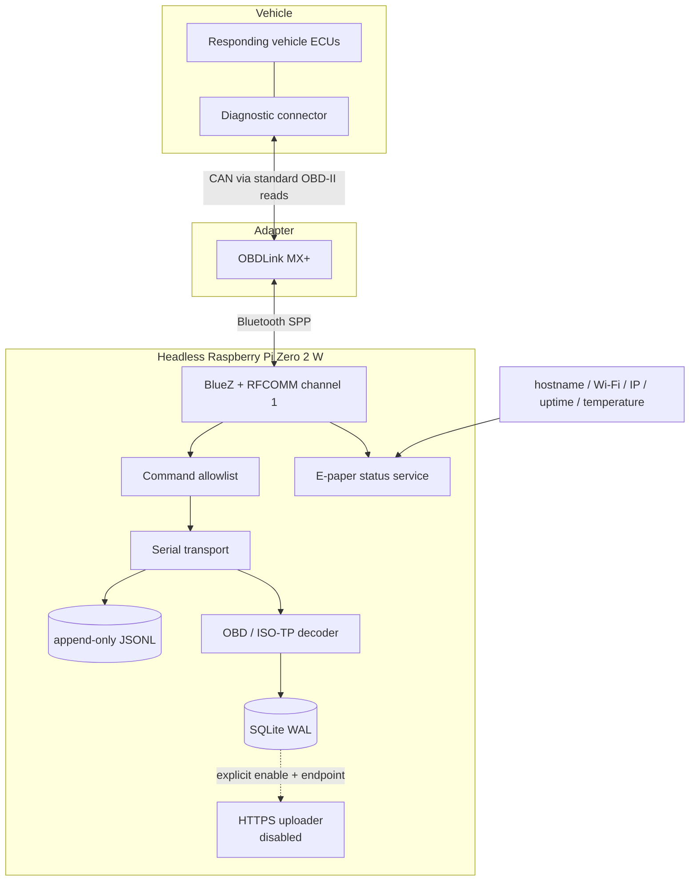

# Architecture

## Design goals

This node is designed around four constraints:

1. **Fail closed at the vehicle boundary.** Only explicitly approved read-only
   commands may be transmitted.
2. **Preserve source evidence.** The exact request and response bytes are
   durable before any decoder interprets them.
3. **Run reliably on small hardware.** The target is a Pi Zero 2 W with limited
   memory, CPU, storage I/O, and power budget.
4. **Make every risky transition deliberate.** Pairing, the first probe,
   collector autostart, and upload each have separate gates.

Non-goals for this release are enhanced GM/Ultium PID discovery, actuator
control, coding, security access, DTC clearing, and automatic vehicle wake-up.

## Runtime topology



The display does not open the serial device or send a diagnostic command. It
reports only observable host state: whether `/dev/rfcomm0` exists and whether
the collector service is active.

## Trust boundaries

### 1. Command boundary

`SerialTransport.send()` validates every normalized command through
`safety.validate_command()` immediately before writing to the file descriptor.
The gate rejects batching delimiters, unknown commands, forbidden services,
and Mode 22 in this release. An independent forbidden-service set provides a
second check against write/control classes.

Tests use a fake/PTY serial endpoint to assert that rejected input produces
zero transmitted bytes. There is no `--unsafe`, development, or administrator
bypass.

### 2. Pairing and RFCOMM boundary

Initial OBDLink pairing requires an interactive BlueZ `KeyboardDisplay` agent
and human confirmation. The recovery service cannot pair, trust, or remove a
device. It can only select exactly one already `Paired`, `Bonded`, and `Trusted`
device whose name identifies it as an OBDLink, confirm exactly one SPP channel
through SDP, and bind that channel.

Ambiguity is an error:

- zero candidates: wait;
- multiple candidates: refuse;
- incomplete bond state: require a human;
- zero or multiple SPP channels: refuse;
- exactly one bonded candidate and one SPP channel: bind.

### 3. Evidence boundary

`RawLog` opens the session transcript with append semantics. Every TX and RX
record carries:

- a monotonic sequence number;
- a UTC timestamp;
- direction and note;
- byte length;
- hexadecimal bytes;
- base64 bytes;
- a lossy display string for operator convenience.

Each record is flushed and `fsync`'d. Decoders consume the transcript or the
same in-memory response only after the raw bytes have been recorded. The
offline reviewer verifies that hex and base64 decode to the same bytes and
reports corrupt lines rather than silently skipping them.

### 4. Data egress boundary

The uploader requires both `upload.enabled = true` and a non-empty HTTPS
endpoint. It sends decoded samples only, never deletes local rows, and marks a
row uploaded only after a successful response. The reference deployment keeps
upload disabled.

## Session and decode flow

```mermaid
sequenceDiagram
    participant Operator
    participant Probe
    participant Gate as Safety gate
    participant Link as RFCOMM transport
    participant Log as Raw JSONL
    participant Adapter as OBDLink / vehicle
    participant Decoder

    Operator->>Probe: start one supervised probe
    Probe->>Gate: AT/ST initialization command
    Gate-->>Probe: approved
    Probe->>Link: write command + CR
    Link->>Log: append exact TX bytes
    Link->>Adapter: transmit
    Adapter-->>Link: response through prompt
    Link->>Log: append exact RX chunks
    Link-->>Probe: complete raw response
    Probe->>Decoder: parse after evidence is durable
    Decoder-->>Probe: typed value / masked VIN / explicit error
```

The adapter is reset and fingerprinted before protocol auto-selection. Standard
PID support is discovered before interpreting current-data requests. Mode 03,
07, and 0A are reads only. Mode 09 vehicle identity is decoded but masked in
summaries.

## CAN and ISO-TP handling

The validated vehicle uses ISO 15765-4 with 29-bit CAN identifiers at
500 kbit/s. Responses therefore include a four-byte CAN identifier before the
ISO-TP protocol-control byte. `decode.py`:

1. separates the CAN identifier from the transport payload;
2. groups frames by responding ECU;
3. reassembles single- and multi-frame ISO-TP payloads independently per ECU;
4. rejects missing sequence frames or truncated payloads; and
5. decodes a value only from a complete response matching the requested mode
   and PID.

This prevents interleaved multi-ECU responses from being combined and prevents
an incomplete VIN from appearing plausible.

## Persistence model

SQLite uses WAL mode and five logical record groups:

| Table | Purpose |
|---|---|
| `sessions` | Adapter identity, protocol, start/end time, and run status |
| `samples` | Decoded standard PID values plus their raw response hex |
| `dtc_reads` | Mode 03/07/0A read results and raw response hex |
| `vehicle_info` | Masked Mode 09 values and raw response hex |
| `events` | Reconnects, sleep/no-data state, and operator-relevant transitions |

The byte-exact JSONL transcript remains the authoritative transport evidence;
SQLite is the queryable operational view.

## Service model

| Unit | Responsibility | Default policy |
|---|---|---|
| `hummer-display.service` | Render host/link state to e-paper | enable after one visual test |
| `hummer-rfcomm.service` | Hold the known adapter/channel binding | enable after SDP confirmation |
| `hummer-btdiscover.service` | Recover a lost bind for an existing bond | disabled when binding is healthy |
| `hummer-collector.service` | Poll the approved read-only set | disabled pending power/sleep validation |

Unit installation and unit enablement are separate operations. The bootstrap
script installs all four units but enables none.

## Dependency strategy

- Core parsing, safety, storage, and upload logic use the Python standard
  library.
- `pyserial` supplies the RFCOMM serial implementation.
- Pillow supplies the hardware-independent e-paper renderer.
- GPIO/SPI libraries come from Raspberry Pi OS packages on the target.
- The three required Waveshare driver files are fetched from a pinned upstream
  commit; the installer records their source commit and SHA-256 hashes locally.

This split keeps CI hardware-free and leaves Pi-specific modules at the edge.
