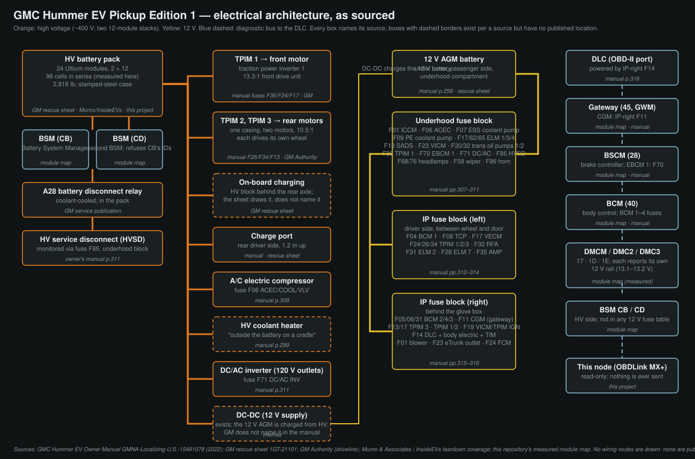

# Electrical architecture

What is known about the GMC Hummer EV Pickup Edition 1's electrical system,
from sources a reader can check, and how it lines up with the modules this
project actually talks to. Nothing here was probed for: the vehicle side is
read-only and stays that way.

**Sources, in order of authority:**

1. **GMC Hummer EV Owner Manual**, GMNA-Localizing-U.S.-15481078 (2022),
   pp. 298–316 — the underhood overview, the cooling-system description, and
   the three fuse blocks with every fuse's usage. The fuse tables are the one
   place GM publishes the *names* of the vehicle's electrical modules.
2. **GM rescue sheet 1GT-21101** — the first-responder drawing, with the HV
   pack, HV cable routing, 12 V battery and an unnamed HV block behind the
   rear axle, in scaled side and plan views.
3. **GM service publication** quoted in this repository for the pack's
   internal coolant passages, which names the *A28 EV Battery Disconnect
   Relay assembly*.
4. **Teardown coverage** (Munro & Associates via InsideEVs, autoevolution):
   pack mass 2,818 lb, "two 400-volt battery packs packaged in parallel —
   one on top of the other — each with 12 battery modules".
5. **This repository's measured module map** ([GM_MODULE_MAP.md](GM_MODULE_MAP.md)):
   eight modules answering for themselves, and 96 cells in series measured
   from the pack's own voltage ratio ([PACK_ARCHITECTURE.md](PACK_ARCHITECTURE.md)).

Where a box on the diagram has a dashed border, the source establishes that
the component exists and says nothing about where it is.

## High voltage

| Component | What is sourced | Where |
|---|---|---|
| Battery pack | 24 Ultium modules as two 12-module stacks in parallel at ~400 V; 96 cells in series per stack, measured here; 2,818 lb; 139-piece stamped-steel case | Under the floor, 2.09 × 1.42 m centred 0.13 m ahead of the wheelbase midpoint, bottom 0.43 m up (rescue sheet, scaled) |
| Battery System Manager ×2 | Modules `CB` and `CD` both report `BSM-BatterySysMngr`; `CD` refuses every identifier `CB` answers | HV side; neither appears in any 12 V fuse table |
| A28 battery disconnect relay assembly | Named by GM's service publication; carries internal coolant passages like the modules | In the pack |
| HV service disconnect (HVSD) | Underhood fuse **F85 HVSD** powers its monitoring circuit | Location not stated in the owner's manual |
| Traction power inverter modules ×3 | **TPIM 1, 2, 3** appear across all three fuse blocks (underhood F36; IP-left F24, F26, F34; IP-right F13, F17; IP-right F19 "VICM TPIM IGN") | On the drive units: one at the front, two in the rear casing |
| Drive motors ×3 | 13.3:1 front, 10.5:1 rear; the two rear motors share one casing; all three motors identical | Front and rear axles |
| On-board charging | The rescue sheet draws an HV block behind the rear axle on the centreline, about 0.5 m across, and routes the charge-port cable to it. The sheet does not name it | −2.17 m, 0.66 m up (rescue sheet, scaled) |
| Charge port | "The charge port door is on the rear driver side" (manual) | −2.53 m, 1.18 m up |
| A/C electric compressor | Underhood fuse **F06 ACEC/COOL/VLV** | Not stated |
| HV coolant heater | "a high voltage heater, located outside the battery on a cradle, heats the coolant" (manual p.299) | On a cradle outside the pack |
| DC/AC inverter | Underhood fuse **F71 DC/AC INV**; feeds the 120 V accessory outlets | Not stated |
| DC-DC converter | Not named in the owner's manual. It exists because the 12 V AGM is charged from the HV pack and three modules each report a 13.1–13.2 V rail | Not stated |

**The manual's cooling description, which is also electrical architecture.**
"During vehicle operation and also during charging, the high voltage battery
cells in the vehicle are kept within a normal operating temperature range. If
the temperature rises above this temperature, the battery cooling system turns
on the air conditioning compressor and cools the coolant until the correct
temperature is reached. If the temperature falls below this temperature, a
high voltage heater, located outside the battery on a cradle, heats the
coolant." The fuse tables then name the pumps: **F07 ESSCP — Energy Storage
System Coolant Pump**, **F09 PECP — Power Electronics Coolant Pump**, **F30 and
F32 — Trans Oil Pump 1 and 2**, **F27 PCV/SCV — Primary/Secondary Coolant
Valve**, **F22 CHFV — Condensing Heating Flow Valve**. So there are at least
two glycol circuits (energy storage and power electronics), two drive-unit oil
pumps, and a refrigerant circuit with a chiller and a condensing heating valve.
That is more than the 3D model's thermal caveat could say when it was written;
the routing between them is still unpublished.

## 12 V

**Battery.** "This vehicle has a high voltage battery and a standard 12-volt
battery." "The vehicle has an Absorbed Glass Mat (AGM) 12-volt battery."
Underhood overview item 1: "Battery (Under Cover)" — under the hood on the
passenger side, which the rescue sheet's plan view confirms with its
low-voltage battery symbol 0.12 m ahead of the front axle and 0.80 m off centre.

**Three fuse blocks**, with the manual's own access notes:

- **Underhood Compartment Fuse Block** — "under a cover and side
  extensions/shields in the underhood compartment"; three bolts on the
  left-side access cover; the fuse puller lives here.
- **Instrument Panel Fuse Block (Left)** — "on the driver side of the
  instrument panel, between the steering wheel and the door".
- **Instrument Panel Fuse Block (Right)** — "behind the glove box".

Part numbers for the blocks themselves: see the section at the end.

### Underhood compartment fuse block (manual pp. 309–311)

| Fuse | Usage |
|---|---|
| F01 | ICCM – Integrated Chassis Control Module |
| F02–F05 | spare |
| F06 | ACEC/COOL/VLV – Air Conditioning Electric Compressor / Coolant Valve |
| F07 | ESSCP – Energy Storage System Coolant Pump |
| F08 | spare |
| F09 | PECP – Power Electronics Coolant Pump |
| F10, F11 | spare |
| F12 | Rear Glass Open |
| F13 | TRLR CONNECTOR – Trailer Brake Connector |
| F14 | spare |
| F15 | CPDL – Charge Port Door Lamp; ALC 1 – Automatic Level Control Main |
| F16 | spare |
| F17 | ELM 1 – Exterior Lighting Module 1 |
| F18 | T/LAMP LT – Tail Lamp Left; SADS – Suspension Control Module |
| F19 | IEC LT 2 – Instrument Panel Fuse Block Left 2 |
| F20, F21 | spare |
| F22 | CHFV – Condensing Heating Flow Valve Motor |
| F23 | T/LAMP RT – Tail Lamp Right; VICM – Vehicle Integrated Control Module |
| F24–F26 | spare |
| F27 | PCV/SCV – Primary Coolant Valve / Secondary Coolant Valve |
| F28 | Park Lamp |
| F29 | spare |
| F30 | TRANS OIL PMP 1 – Trans Oil Pump 1 |
| F31 | spare |
| F32 | TRANS OIL PMP 2 – Trans Oil Pump 2 |
| F33 | REV/LAMP – Reverse Lamp |
| F34 | TIM 1 – Trailer Interface Module Primary |
| F35 | spare |
| F36 | TPIM 1 – Traction Power Inverter Module 1 |
| F37 | spare |
| F38 | TRLR ST/TRN LT – Trailer Stop/Turn Lamp Left |
| F39 | TRLR ST/TRN RT – Trailer Stop/Turn Lamp Right |
| F40 | VLM – Vehicle Leveling Module |
| F41 | spare |
| F42 | Rear Glass Close |
| F43–F48 | spare |
| F49 | TBPM – Trailer Brake Power Module |
| F50 | spare |
| F51 | 2ND ROW RT – Second Row Fold Right |
| F52, F53 | spare |
| F54 | PFCM – Power Front Closure Module |
| F55 | Defog Rear |
| F56, F57 | spare |
| F58 | FRNT WIPER – Front Wiper |
| F59 | TIM 2 – Trailer Interface Module 2 |
| F60, F61 | spare |
| F62 | ELM 3 – Exterior Lighting Module 3 |
| F63, F64 | spare |
| F65 | ELM 4 – Exterior Lighting Module 4 |
| F66 | AUX PRK LAMP – Auxiliary Park Lamp |
| F67 | spare |
| F68 | HDLP LT/AUX PRK LAMP LT – Headlamp Left / Auxiliary Park Lamp Left |
| F69 | UNDR BODY CAMERA – Underbody Camera |
| F70 | EBCM 1 – Electronic Brake Control Module 1 |
| F71 | DC/AC INV – DC/AC Inverter |
| F72–F75 | spare |
| F76 | HDLP RT/AUX PRK LAMP RT – Headlamp Right / Auxiliary Park Lamp Right |
| F77 | spare |
| F78 | 2ND ROW LT – Second Row Fold Left |
| F79 | FT Radar – Front Radar |
| F80 | IEC RT 2 – Instrument Panel Fuse Block Right 2 |
| F81 | IEC LT 1 – Instrument Panel Fuse Block Left 1 |
| F82–F84 | spare |
| F85 | HVSD – High Voltage Service Disconnect |
| F86 | Horn |
| F87 | FRT WSHR PMP – Front Washer |
| F88 | RR WSHR PMP – Rear Washer |
| F89 | CAMERA WASH MTR – Camera Wash Motor |
| F90 | MSB/PASS – Passenger Motorized Seat Belt |
| F91 | MSB/DRVR – Driver Motorized Seat Belt |

### Instrument panel fuse block, left (manual pp. 313–314)

| Fuse | Usage |
|---|---|
| F01 | DSM – Driver Power Seat |
| F02 | SDM/AOS – Sensing and Diagnostic Module / Automatic Occupant Sensing |
| F03 | VKS/TTPM/SRR – Virtual Key System / Trailer Tow Power Module / Short Range Radar |
| F04 | BCM 1 – Body Control Module 1 |
| F05 | ELM 5 – Exterior Lighting Module 5 |
| F06 | ENDGATE 1 – Minor End Gate |
| F07 | spare |
| F08 | TCP – Telematics Control Platform |
| F09 | Lumbar |
| F10 | WCM – Wireless Charger Module; HVAC Display |
| F11 | 2ND HTD SEAT – 2nd Row Heated Seat (1 and 2) |
| F12 | OUT OF PRK DSBL – Out of Park |
| F13 | VPM – Video Process Module; EOCM – External Object Calculation Module |
| F14, F15 | spare |
| F16 | Tonneau |
| F17 | VECM – Vehicle Extension Control Module |
| F18, F19 | spare |
| F20 | DRVR MSM – Memory Seat Module Driver |
| F21 | DSP – Designated Seating Position; HTD/CLD SEAT – Heated Seat Module Row 1 |
| F22 | spare |
| F23 | ENDGATE 2 – End Gate Motor |
| F24 | TPIM 1 – Traction Power Inverter Module 1 |
| F25 | spare |
| F26 | TPIM 2 – Traction Power Inverter Module 2 |
| F27 | FRT HTD SEAT MDL – Heated Seat Module Row 1 |
| F28 | ELM 7 – Exterior Lighting Module 7 |
| F29 | OBS DET – Obstacle Detection |
| F30 | ENDGATE 2 MTR GRND – Major End Gate Motor Ground |
| F31 | ELM 2 – Exterior Lighting Module 2 |
| F32 | RFA – Remote Function Actuator |
| F33 | ENDGATE MTR 2 – Motor |
| F34 | TPIM 3 – Traction Power Inverter Module 3 |
| F35 | AMP – Amplifier |
| F36 | PASS PWR SEAT – Passenger Power Seat |
| F37, F38 | spare |
| F39 | RT WNDW – Right Hand Power Window |
| F40 | LT WNDW – Left Hand Power Window |
| CB01, CB02 | spare circuit breakers |

### Instrument panel fuse block, right (manual pp. 315–316)

| Fuse | Usage |
|---|---|
| F01 | FRT BLWR MTR – Front Blower Motor |
| F02 | PWR STR COL MDL – Steering Column Adjust Module |
| F03 | ESC/SCL 1 – Electronic Transmission Range System / Steering Column Lock |
| F04 | spare |
| F05 | BCM 2 – Body Control Module 2 |
| F06 | BCM 4 – Body Control Module 4 |
| F07 | spare |
| F08 | TBCS/EPB – Trailer Brake Control Switch / Electric Park Brake |
| F09 | spare |
| F10 | Displays; NVM – Night Vision Module |
| F11 | HDLM – High Definition Localization Module; CGM – Central Gateway Module |
| F12 | SCL 2 – Steering Column Lock |
| F13 | TPIM 3 – Traction Power Inverter Module 3 |
| F14 | DLC – Data Link Connection; BODY ELEC – Body Electric; TIM – Trailer Interface Module |
| F15 | Driver INFO |
| F16 | (not listed) |
| F17 | TPIM 1 – Traction Power Inverter Module 1; TPIM 2 – Traction Power Inverter Module 2 |
| F18 | MISC Body; MISC IP 2 – Instrument Panel 2 |
| F19 | VICM TPIM IGN – Vehicle Integration Control Module / Traction Power Inverter Module / Ignition |
| F20–F22 | spare |
| F23 | eTrunk APO – eTrunk Auxiliary Power Outlet |
| F24 | RAIN SNSR/FCM – Rain Sensor / Front Camera Module |
| F25 | AUX USB – Auxiliary USB |
| F26 | ELM 6 – Exterior Lighting Module 6 |
| F27 | CSM/AUX – Center Stack Module / Auxiliary Jack |
| F28 | spare |
| F29 | DMS – Driver Monitoring System |
| F30 | spare |
| F31 | BCM 3 – Body Control Module 3 |
| F32 | HSWM – Heating Steering Wheel Module |
| F33, F34 | spare |
| F35 | SWING GATE MDL – Module-power Tailgate (Swing-gate) |
| F36 | REAR HVAC BLWR – Rear HVAC Blower Motor |
| F37, F38 | spare |
| F39 | SWING GATE MDL 2 |

The manual warns on every table that "the vehicle may not be equipped with all
of the fuses and features shown"; these are the 2022 U.S. tables as printed.

## What this project talks to, and what feeds it

| Module (address) | Name it reports | Fed by | Notes |
|---|---|---|---|
| `45` | Gateway Module – GWM | IP-right **F11 CGM** | The manual's "Central Gateway Module"; reachable, holds no identification identifiers |
| `40` | BCM-BodyControl | IP-left **F04**, IP-right **F05/F06/F31** (BCM 1–4) | Nine enhanced identifiers proven, only at CAN priority `0x18` |
| `28` | BSCM-BrakeSystem | Underhood **F70 EBCM 1** | Wheel speeds, brake pressure, steering angle |
| `17`, `1D`, `1E` | DMCM / DMC2 / DMC3 – DriveMotorCtrl | Almost certainly the manual's **TPIM 1/2/3** (underhood F36; IP-left F24/F26/F34; IP-right F13/F17/F19). The pairing of `17`→TPIM 1 is an inference from the numbering, not a measurement | Each reports its own 12 V rail at `0x33E5` (13.1–13.2 V); pack voltage at `0x2885` |
| `CB`, `CD` | BSM-BatterySysMngr | Not in any 12 V fuse table | HV-side controllers; `CB` answers the pack's state, `CD` refuses |
| DLC | — | IP-right **F14 DLC** | The port this node's OBDLink MX+ plugs into |

The modules the fuse tables name that this project has **never** reached —
ICCM, VICM, SADS, VLM, ELM 1–7, TCP, VECM, PFCM, and the rest — are body and
chassis controllers on buses the gateway does not forward to the DLC as
diagnostic responses. Lamp state in particular lives in the ELMs; that is why
[the catalogue](TELEMETRY_CATALOG.md) records lighting as absent.

## What is not published

- The **routing** of any 12 V harness, and of the HV cables beyond the rescue
  sheet's single run from the charge port forward along the driver's side to
  the pack and from the pack to each drive unit.
- The **location** of the HV service disconnect, the DC-DC converter, the
  DC/AC inverter, the A/C compressor and the HV heater's cradle.
- **Fuse ratings.** The manual prints usage, not amperage.
- **Part numbers** for the fuse blocks — see below.

## Part numbers

Read off GM catalogue pages (gmpartsgiant.com) on 2026-09-14, fitment as the
page states it. The instrument panel fuse blocks are not listed as separate
parts; the catalogue folds them into the harness and body-control assemblies.

| Part | GM number | Catalogue name | Fitment |
|---|---|---|---|
| Underhood fuse block | 86591540 | Block Assembly-Bat Distribution Eng Compt Fuse | 2022–2024 Hummer EV |
| Underhood junction block | 85573517, 85609049 | Block Asm-Eng Wrg Harn Junc | 2023, 2023–2024 |
| Underhood fuse block kit | 84669070, 87821881 | Block Kit-Bat Distribution Eng Compt Fuse | 2022–2024 |
| HV battery disconnect relay fuse | 24045190 | Fuse-High Vltg Bat Disconnect Rly | 2022–2024 |
| Its cover | 24049297 | Cover-High Vltg Bat Disconnect Rly | 2022–2024 |
| Charger disconnect relay | 24046182 | Relay Asm-Drv Mot Bat Charger Mdl | 2024 |
| Charger receptacle fuse block | 24046644 (24051375) | Block Asm-Drv Mot Bat Charger Rcpt Fuse | 2024 |
| DC-DC / accessory power module | 84978033 (84978034, 86591121) | Module Asm-Acsry AC & DC Pwr Cont (w/brkt) | 2022–2024 |
| Traction power inverter module | 24049478 (24053090) | Module Asm-Drv Mot Pwr Dstrbn Cont (HW) E | 2022–2024 |
| HV battery heater | 86549712 | Module Asm-High Vltg Bat Htr | 2022–2024 |
| HV battery pack | 24061750 / 24061751 / 24061752 | Battery Asm, High Vltg | 2024 |
| Serial data gateway | 13551131 | Module Asm-Serial Data Gateway | 2022–2024 |

So the DC-DC converter the manual never names has a catalogue name — GM's
"accessory AC & DC power control module", the APM — and the manual's TPIM is
the catalogue's "drive motor power distribution control module". Not found:
a part listed as the Vehicle Integrated Control Module (VICM); the 12 V AGM
battery's ACDelco number (a retailer snippet says BCI group 94R, 850 CCA,
which could not be read from the page itself and is not relied on here).

**The full Emergency Response Guide** (twelve pages, beyond the one-page
rescue sheet) is at
`gmstc.com/wp-content/uploads/2022/12/GMC-Hummer-EV-Pickup-2022-Emergency-Response-Guide_English.pdf`.
It adds one location the sheet does not: the low-voltage cut point is "above
the battery on the right side of the forward compartment", marked with yellow
tape. Its HV diagram marks the drive units and the charge port and labels no
component by name.
